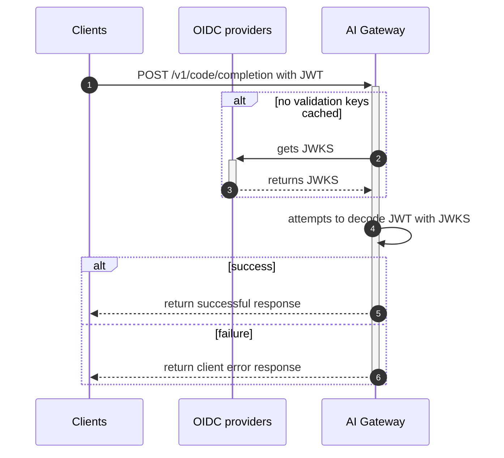

# Authentication and Authorization

## Authentication in AI Gateway

AI Gateway uses OIDC Discovery for authenticating incoming requests. Here is an overview of the process:



Participants:

- Clients: IDE extensions, Language server and GitLab-Rails (for example, `VertexAI::Client`).
- OIDC providers: GitLab instance (Multi-tenant SaaS GitLab `gitlab.com` or self-hosted instance) and Customer Dot (`customers.gitlab.com`).
- AI Gateway: GitLab-managed service to provide AI related features (`cloud.gitlab.com/ai`).

Process flow:

1. The client sends a request to the AI Gateway with a JWT. The token is provided by the GitLab Rails application.
1. To validate the token, the AI gateway must first obtain a JWKS key set. It will cache these keys for some time.
1. AI Gateway attempts to decode the JWT with JWKS provided by trusted OIDC providers.
1. If AI Gateway successfully decodes the JWT, the client request is authenticated and passed to the feature endpoints
   (for example, `POST /v1/chat/agent`). For further authorization process, see [authorization in AI Gateway](#authentication-in-ai-gateway).
1. If AI Gateway fails to decode the JWT, AI Gateway returns an error response to the client, which could happen in the following cases:
   - The client got an JWT from an OIDC provider that is not trusted by AI Gateway.
   - The client didn't include a JWT in the `Authorization` HTTP header.
   - The value of `X-Gitlab-Authentication-Type` HTTP header is not `oidc`.
   - The value of `X-Gitlab-Realm` HTTP header and the value of `gitlab_realm` JWT claim do not match.
   - The value of `X-Gitlab-Instance-Id` HTTP header and the value of `subject` JWT claim do not match.

Notes:

- Authentication happens in a middleware named `MiddlewareAuthentication`.
  This middleware is processed for all incoming requests before passing them to feature endpoints.
- There is a case that a client and an OIDC provider co-exist in the same server.
  For example, an OIDC provider as multi-tenant SaaS GitLab and a client as GitLab-Rails co-exist in `gitlab.com`
  or when self-hosting the AI gateway.

### OIDC providers

The AI gateway needs to fetch validation keys (JSON Web Key Set / JWKS) from OIDC providers to validate access tokens.
To that end, it will dial the endpoint `/.well-known/openid-configuration` for each configured provider
to first obtain the JWKS URI. We then call this URI to fetch the JWKS.
We cache the JWKS for 24 hours and use it to validate the authenticity of all requests.

### Configure OIDC providers in AI Gateway

Which OIDC providers should be used depends on who provides tokens in the first place:

- When it's the Customers Portal (CDot) from which your access tokens are synced, set `AIGW_CUSTOMER_PORTAL_URL`
- When it's your local GitLab instance that self-issues access tokens, set `AIGW_GITLAB_URL`

You can also set both. Cloud Connector will try to fetch keys from all configured OIDC providers and merge their key sets.

For example, to use OIDC, set the following in `.env`:

```shell
# To test multi-tenant SaaS GitLab instance as OIDC provider
# i.e. set `GITLAB_SIMULATE_SAAS=1` in your GDK.
AIGW_GITLAB_URL=http://<your-gdk-address>/    # e.g. http://gdk.test:3000/

# To test CustomersDot as OIDC provider
AIGW_CUSTOMER_PORTAL_URL=http://<your-customer-dot-address> # e.g. http://127.0.0.1:5000
```

#### Self-signed SSL certificates

If your GitLab instance or model endpoint is configured either with a self-signed certificate, or a certificate from an custom certificate authority (CA), you need to pass your root CA's cert to the AI
Gateway for authentication to succeed. You can do so by setting the `REQUESTS_CA_BUNDLE` environment variable (see
<https://requests.readthedocs.io/en/latest/user/advanced/#ssl-cert-verification>). Since we rely on
[`certifi`](https://github.com/certifi/python-certifi) for our base trusted CA list, you can configure a custom CA
bundle as follows:

- Download `certifi`'s `cacert.pem` file:

```shell
curl "https://raw.githubusercontent.com/certifi/python-certifi/2024.07.04/certifi/cacert.pem" -o cacert.pem
```

- Append your self-signed CA's root cert to the file. For example, if you used `mkcert` to create your certificate:

```shell
cat "$(mkcert -CAROOT)/rootCA.pem" >> /path/to/your/cacert.pem
```

- Set `REQUESTS_CA_BUNDLE` to the path of your `cacert.pem`. In GDK you can do so by adding the following to your
`$GDK_ROOT/env.runit`:

```env
export REQUESTS_CA_BUNDLE=/path/to/your/cacert.pem
```

### Ensure `CLOUD_CONNECTOR_SERVICE_NAME` is set

**NOTE:** Only necessary if you don't use the Docker container.

When validating tokens, we verify that the token `aud` claim (audience) matches the system name the token is sent to.

Make sure to set the following in `.env`:

```shell
# For AI Gateway
AIGW_CLOUD_CONNECTOR_SERVICE_NAME="gitlab-ai-gateway"
# For Duo Workflow Service
DUO_WORKFLOW_CLOUD_CONNECTOR_SERVICE_NAME="gitlab-duo-workflow-service"
```

These environment variables are converted to `CLOUD_CONNECTOR_SERVICE_NAME` environment variable in the runtime.

#### Bypass JWT verification for testing

`CompositeProvider` verifies the JWT signature sent to the AI Gateway
has been signed by a JWKS from either `AIGW_GITLAB_URL` or
`AIGW_CUSTOMER_PORTAL_URL`.

During development and testing, GitLab instances may be configured to
generate self-signed JWT tokens (`CLOUD_CONNECTOR_SELF_SIGN_TOKENS=1` in
GitLab Rails) instead of requesting tokens signed by `customers.gitlab.com`.

If you are testing multiple GitLab instances that use self-signed
tokens, then you may want to bypass JWT signature verification by
setting the following in `.env`:

```shell
AIGW_AUTH__BYPASS_JWT_SIGNATURE=1
```

### Bypass authentication and authorization for testing features

If you want to quickly test features in GDK,
you can disable the auth logic by changing the following application setting in `.env`:

```shell
AIGW_AUTH__BYPASS_EXTERNAL=true
```

## Rotate AI Gateway and Duo Workflow Service JWT keys

This page is the single canonical runbook for rotating the self-signed JWT keys used by
AI Gateway and the Duo Workflow Service. Do not duplicate these steps elsewhere; link here
instead.

The JWK signing key is used to sign User JWTs when requested by a GitLab instance. The
validation key is a secondary key used purely for token validation whenever the signing key
expires or is rotated. This ensures we always have a key in place to sign and validate tokens.

Operational context for running this against production, including the change-request
process, lives in the [AI Gateway runbook](https://gitlab.com/gitlab-com/runbooks/-/blob/master/docs/ai-gateway/README.md#rotating-jwt-signing-keys).

The signing and validation keys must be rotated yearly. Rotation happens in two phases
separated by three days so existing tokens remain valid.

> [!IMPORTANT]
> Start with staging and validate it before changing production. Notify
> `#g_ai-core-infra` before production work. Avoid Fridays and public holidays,
> and ensure sufficient team coverage.

Anyone with Vault access to the relevant paths can perform these rotations, not just AI Core
Infra team members. For additional help, contact the `#g_ai-core-infra` channel.

### Vault locations

| Service | Staging | Production |
|---|---|---|
| AI Gateway | [Open staging Vault](https://vault.gitlab.net/ui/vault/secrets-engines/runway/kv/list/env/staging/service/ai-gateway/) | [Open production Vault](https://vault.gitlab.net/ui/vault/secrets-engines/runway/kv/list/env/production/service/ai-gateway/) |
| AI Gateway Custom | [Open staging Vault](https://vault.gitlab.net/ui/vault/secrets-engines/runway/kv/list/env/staging/service/ai-gateway-custom/) | [Open production Vault](https://vault.gitlab.net/ui/vault/secrets-engines/runway/kv/list/env/production/service/ai-gateway-custom/) |
| AI Gateway Panda | [Open staging Vault](https://vault.gitlab.net/ui/vault/secrets-engines/runway/kv/list/env/staging/service/ai-gateway-panda/) | [Open production Vault](https://vault.gitlab.net/ui/vault/secrets-engines/runway/kv/list/env/production/service/ai-gateway-panda/) |
| Duo Workflow Service | [Open staging Vault](https://vault.gitlab.net/ui/vault/secrets-engines/runway/kv/list/env/staging/service/duo-workflow-svc/) | [Open production Vault](https://vault.gitlab.net/ui/vault/secrets-engines/runway/kv/list/env/production/service/duo-workflow-svc/) |

GLGO is deployed through Runway as well, but its Vault path is not listed here because
it is owned by the GLGO service rather than this team. Ask in `#g_ai-core-infra` or the
GLGO owners for access to `GLGO_KNOWN_ISSUER_KEYS_CC` before starting a rotation.

The affected variables are:

| Service | Active key | Transitional validation key |
|---|---|---|
| AI Gateway | `AIGW_SELF_SIGNED_JWT__SIGNING_KEY` | `AIGW_SELF_SIGNED_JWT__VALIDATION_KEY` |
| Duo Workflow Service | `DUO_WORKFLOW_SELF_SIGNED_JWT__SIGNING_KEY` | `DUO_WORKFLOW_SELF_SIGNED_JWT__VALIDATION_KEY` |
| GLGO | `GLGO_KNOWN_ISSUER_KEYS_CC` | not applicable, holds trusted public keys |

`GLGO_KNOWN_ISSUER_KEYS_CC` is a comma-separated list of `<issuer>;<public-key>` pairs. It
holds one entry per AI Gateway deployment that signs requests to GLGO, so a rotation edits
only the entry for the deployment whose signing key changed.

### Phase 1: Rotate the signing keys

Complete every step in staging before repeating the process in production.

#### 1. Preserve the outgoing keys

For each service, copy the current signing key into its validation key:

- Copy `AIGW_SELF_SIGNED_JWT__SIGNING_KEY` to
  `AIGW_SELF_SIGNED_JWT__VALIDATION_KEY`.
- Copy `DUO_WORKFLOW_SELF_SIGNED_JWT__SIGNING_KEY` to
  `DUO_WORKFLOW_SELF_SIGNED_JWT__VALIDATION_KEY`.

This allows existing tokens to remain valid after the active keys change.

#### 2. Generate new signing keys

Generate a separate private key for each service:

```shell
openssl genrsa -out ai_gateway_signing.key 2048
openssl genrsa -out duo_workflow_signing.key 2048
```

Do not commit these files or share their contents in an issue, merge request,
Slack message, or job log.

#### 3. Update GLGO trust first

This step applies only to the AI Gateway key. AI Gateway signs the Amazon Q token requests it
sends to GLGO, and GLGO verifies them against a static public key. There is no JWKS endpoint
for GLGO to discover the new key, so trust must be established before the private key changes.

Extract the public key:

```shell
openssl rsa \
  -in ai_gateway_signing.key \
  -pubout \
  -out ai_gateway_signing.pub
```

Before changing `AIGW_SELF_SIGNED_JWT__SIGNING_KEY`, append the new public key
to `GLGO_KNOWN_ISSUER_KEYS_CC`:

```plaintext
,<issuer>;<new-public-key>
```

For production, the issuer is:

```plaintext
https://cloud.gitlab.com
```

The resulting addition is:

```plaintext
,https://cloud.gitlab.com;<new AI Gateway public key>
```

Preserve the existing key. GLGO must temporarily trust both the outgoing and
incoming AI Gateway keys. Redeploy GLGO and confirm it starts successfully
before continuing.

#### 4. Activate the new keys

Update Vault with the generated private keys:

- Set `AIGW_SELF_SIGNED_JWT__SIGNING_KEY` to `ai_gateway_signing.key`.
- Set `DUO_WORKFLOW_SELF_SIGNED_JWT__SIGNING_KEY` to
  `duo_workflow_signing.key`.

Redeploy the affected services so they load the new Vault versions.

For DWS, deploy through the
[Duo Workflow Service deployment pipelines](https://gitlab.com/gitlab-com/gl-infra/platform/runway/deployments/duo-workflow-svc/-/pipelines).

#### 5. Validate the environment

Confirm:

- AI Gateway authentication works.
- A Duo Agent Platform workflow completes successfully.
- An Amazon Q request succeeds through GLGO.
- Service logs show no JWT validation errors.
- HTTP 401 rates remain at their normal baseline.

After staging passes these checks, repeat Phase 1 in production,
**including step 6**. Each environment gets its own Phase 2 reminder,
scheduled three days after *that environment's* signing-key rotation
(not three days after the first, staging, rotation). You will end up
with two separate Phase 2 reminders — one for staging, one for
production — each retiring the validation key for its own environment.

#### 6. Schedule Phase 2

Create a reminder in `#g_ai-core-infra` to complete Phase 2 three days later.

### Phase 2: Retire the outgoing keys

After three days, complete these steps in staging and then production.

1. Generate separate replacement validation keys:

   ```shell
   openssl genrsa -out ai_gateway_validation.key 2048
   openssl genrsa -out duo_workflow_validation.key 2048
   ```

1. Update Vault:

   - Replace `AIGW_SELF_SIGNED_JWT__VALIDATION_KEY`.
   - Replace `DUO_WORKFLOW_SELF_SIGNED_JWT__VALIDATION_KEY`.

1. Redeploy AI Gateway and Duo Workflow Service.

1. Remove the outgoing AI Gateway public key from
   `GLGO_KNOWN_ISSUER_KEYS_CC`. Keep the new public key.

1. Redeploy GLGO.

1. Repeat the validation checks from Phase 1.

1. Delete all locally generated key files securely.

1. Create an issue and Slack reminder one month before the next annual
   rotation.

### Rollback

Vault retains secret version history.

If authentication fails:

1. Restore the previous Vault version of the affected key.
1. Restore the previous `GLGO_KNOWN_ISSUER_KEYS_CC` value when applicable.
1. Redeploy the affected services.
1. Confirm JWT errors and HTTP 401 rates return to baseline.

## Authorization in AI Gateway

AI Gateway uses `scopes` custom claim in JWT to check user permissions, which was decoded in [the previous authentication process](#authentication-in-ai-gateway).

For example, if a decoded token contains the following `scopes`, the user can access to `complete_code` and `duo_chat` features:

```json
{
    scopes: [
        'generate_code',
        'duo_chat'
    ],
    // ... and the other claims, such as `aud`, `sub`, etc.
}
```

Notes:

- Available feature names are listed in [`GitLabUnitPrimitive`](https://gitlab.com/gitlab-org/modelops/applied-ml/code-suggestions/ai-assist/-/blob/main/ai_gateway/gitlab_features.py).

### Get current user and check permission

You can get a currently authenticated user and check if the user has permission to access a specific feature.
This is useful to granularly switch the business logic per user permissions. Example:

```python
from ai_gateway.api.auth_utils import get_current_user, StarletteUser


@router.post("/awesome_feature")
async def awesome_feature(
        request: Request,
        current_user: Annotated[StarletteUser, Depends(get_current_user)]
):
    if current_user.can(GitLabUnitPrimitive.AWESOME_FEATURE_1):
    # Do X
    elif:
        current_user.can(GitLabUnitPrimitive.AWESOME_FEATURE_2):
    # Do Y
    else:
        raise HTTPException(
            status_code=status.HTTP_403_FORBIDDEN,
            detail=f"Unauthorized to access awesome feature",
        )
```

### Use `x-gitlab-unit-primitive` header

As an alternative approach to the [fine-grained authorization](#get-current-user-and-check-permission),
you can also enable authorization on a specific endpoint with `authorize_with_unit_primitive_header`.
This decorator reads the `x-gitlab-unit-primitive` header from requests and
checks if the user has permission to access the unit primitive. Example:

```python
from ai_gateway.api.v1.proxy.request import authorize_with_unit_primitive_header


@router.post("/awesome_feature")
@authorize_with_unit_primitive_header()
async def awesome_feature(
        request: Request,
):
# Do something
```
