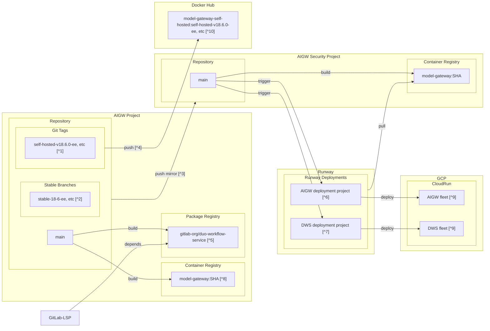

# Delivery process overview of GitLab AI Gateway

Notes:

- `[^1]`: Git-Tags that are created by [GitLab-Rails](https://gitlab.com/gitlab-org/gitlab). See [Release](./release.md) for more information.
- `[^2]`: Git-Branches that are created by [GitLab-Rails](https://gitlab.com/gitlab-org/gitlab). See [Release](./release.md) for more information.
- `[^3]`: Changes on the canonical repository are mirrored to the security repository.
  - e.g. When a merge request is merged into `main` branch of the canonical repository:
    - The merge commit in the canonical repository triggers a CI/CD pipeline in the canonical project.
    - The merge commit is immediately mirrored to the security repository. The merge commit in the security project triggers a CI/CD pipeline in the security project.
- `[^4]`: When a Git-Tag is created, a CI/CD pipeline builds and push the Docker image to Docker Hub. See [Release](./release.md) for more information.
- `[^5]`: Node gRPC client lib that is used by [GitLab-LSP](https://gitlab.com/gitlab-org/editor-extensions/gitlab-lsp).
- `[^6]`: [AIGW deployment project](https://gitlab.com/gitlab-com/gl-infra/platform/runway/deployments/ai-gateway)
- `[^7]`: [DWS deployment project](https://gitlab.com/gitlab-com/gl-infra/platform/runway/deployments/duo-workflow-svc)
- `[^8]`: Docker images that are used for non-production environments e.g. `dws-loadtest` Runway deployment.
- `[^9]`: Requested by GitLab.com, Dedicated and Self-managed GitLab customers (except self-hosted Duo customers).
- `[^10]`: Pulled by self-hosted Duo customers who host AIGW/DWS fleet on their own (e.g. airgapped). See [Install the GitLab AI gateway](https://docs.gitlab.com/install/install_ai_gateway/) and [GitLab Duo Self-Hosted](https://docs.gitlab.com/administration/gitlab_duo_self_hosted/) for more information.

Related docs:

- [Release](./release.md)
- [Security fixes](./security_fixes.md)
- [GitLab AI Gateway project provisioning process](https://internal.gitlab.com/handbook/engineering/ai/ai-gateway/provisioning/) (Internal only)
