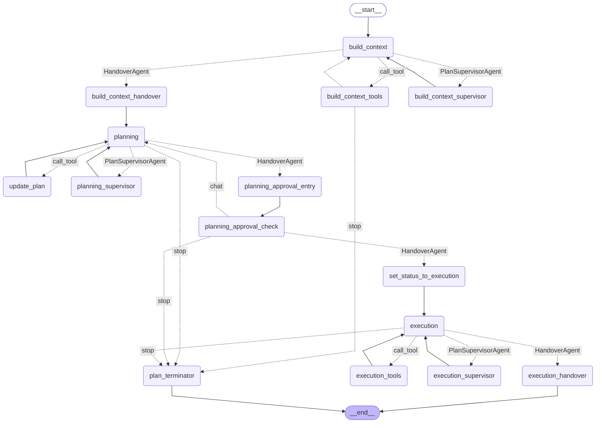

# Duo Workflow Service

The Duo Workflow Service is a Python-based component within GitLab
architecture that manages and executes AI-powered workflows using
LangGraph. It handles communication between the user interface, the
LLM provider, and the Duo Workflow Executor, while maintaining
workflow state through periodic checkpoints saved to GitLab. This
service provides the intelligence layer that interprets user goals,
plans execution steps, processes LLM responses, and orchestrates the
necessary commands to complete tasks - all while maintaining a secure
boundary between untrusted code execution and the core GitLab
infrastructure.

## Quick start

- Install required tools.

  ```shell
  mise install # or
  asdf install
  ```

- Install project dependencies.

  ```shell
  poetry install
  ```

- Configure environment.

  ```shell
  cp .env.example .env
  ```

- Run the service.

  ```shell
  poetry run duo-workflow-service
  ```

- Run tests.

  ```shell
  make test
  ```

- Run linter.

  ```shell
  make lint
  ```

- Generate Protobuf files.

  ```shell
  make gen-proto
  ```

- Test the client.

  ```shell
  poetry run python -m duo_workflow_service.client
  ```

## LLM Caching

Real calls to LLMs tend to be slow and expensive. Often during development we
are just testing the same prompt over and over while iterating on other parts
of the workflow. To speed up development and save money on LLM tokens, you can
add the following to `.env`:

```shell
LLM_CACHE=true
```

When enabled all queries will be cached to a local SQLite file at
`.llm_cache.db`. You can delete this file at any time to clear the
cache.

## Setting up local development for Duo Workflow

For ease of use you can you can [set up Duo Workflow Service directly with GDK](https://gitlab.com/gitlab-org/gitlab-development-kit/-/blob/main/doc/howto/duo_workflow.md?ref_type=heads).

To manually set it up do the following:

1. Install dependencies with [poetry](https://python-poetry.org/docs/#installing-with-pipx).

   ```shell
   poetry install
   ```

1. Copy the example env file in the Service repo.

   ```shell
   cp .env.example .env
   ```

1. Setup [`gcloud`](https://cloud.google.com/sdk/docs/install) on your system.
1. Login using your GitLab Google account by running:

   ```shell
   gcloud auth login
   ```

1. Set the `ai-enablement-dev-69497ba7` as active project by running:

   ```shell
   gcloud config set project ai-enablement-dev-69497ba7
   ```

1. Create the credentials for the application.

   ```shell
   gcloud auth application-default login --disable-quota-project
   ```

1. Optional: The `ai-enablement-dev-69497ba7` Google Cloud project should by available to all engineers at GitLab. If you do not have access to this project, unset `DUO_WORKFLOW__VERTEX_PROJECT_ID` in `.env` and instead set `ANTHROPIC_API_KEY` to a valid Anthropic API key.

1. Optional: You can disable auth for local development in the `.env` file. This disables authentication or the gRPC connection between the Duo Workflow Service and Duo Workflow Executor but a token will still be required for requests to your local GitLab instance.

   ```shell
   DUO_WORKFLOW_AUTH__ENABLED=false
   ```

1. Run the Duo Workflow Service server.

   ```shell
   poetry run python -m duo_workflow_service.server
   ```

1. If you can correctly connect to Claude, you should see something
   like this in the output.

   ```shell
   {"event": "Connected to model: claude-3-5-sonnet-v2-20241022: I am Claude, an AI assistant created by Anthropic."...
   ```

## Architecture

<https://docs.gitlab.com/ee/architecture/blueprints/duo_workflow/>

### LangGraph Abstraction Layers

The Duo Workflow Service is organized into three distinct abstraction layers to support modularity, flexibility, and future extensibility.


1. **LangGraph APIs Layer**

   - The foundational layer that directly interacts with the LangGraph package.
   - External to GitLab repository and accessed via LangGraph package imports.
   - Provides low-level functionality for building workflow graphs.

1. **Components Layer**

   - First layer implemented directly in the Duo Workflow Service repository.
   - Uses LangGraph APIs to build modular graph components.
   - Creates reusable templates for workflow configurations.
   - Serves as a facade between low-level LangGraph APIs and high-level workflows.

1. **Workflows Layer**
   - Houses ready-to-use workflow configurations.
   - Built by combining components from the Components layer.
   - Configured with prompts and agent configurations from `AgentRegistry`.
   - Serves as a simplified entry point for building agentic features

Each layer is restricted to using only entities from the layer directly below it, enforced through static scanning in CI. This architecture ensures:

- Modular and maintainable codebase.
- Support for future extensions like YAML DSL for external workflow configurations.
- Clear separation of concerns between different abstraction levels.

### Current Graph structure



## Using memory checkpointer

By default GitLab
[checkpointer](https://langchain-ai.github.io/langgraph/reference/checkpoints/#checkpoints)
is used for storing LangGraph checkpoints. For running automated tests, it can
be useful to store checkpoints only in memory - you can use `USE_MEMSAVER=1`
environment variable to use `MemorySaver`.

When using `MemorySaver`, human in the loop features and workflow status updates are disabled.

## Debugging and troubleshooting

See Duo Workflow [troubleshooting handbook page](https://handbook.gitlab.com/handbook/engineering/development/data-science/ai-powered/duo-workflow/troubleshooting/).

### Issues connecting to 50052 port

JAMF may be listening on the `50052` port which will conflict with GitLab Duo Workflow Service.

```shell
$ sudo lsof -i -P | grep LISTEN | grep :50052
jamfRemot  <redacted>           root   11u  IPv4 <redacted>      0t0    TCP localhost:50052 (LISTEN)
```

To work around this,run the server on 50053 with:

```shell
PORT=50053 poetry run duo-workflow-service
```

### Visualise graph

To visualise current graph structure use following snippet in Python console, use the following code snippet.

```python
from unittest.mock import AsyncMock, MagicMock, call, patch
from duo_workflow_service.components import ToolsRegistry
from duo_workflow_service.internal_events.event_enum import CategoryEnum
from duo_workflow_service import tools

from duo_workflow_service.workflows.software_development import Workflow
from langchain_core.runnables.graph import CurveStyle, MermaidDrawMethod, NodeStyles
from langgraph.checkpoint.memory import MemorySaver

tools_reg = MagicMock(spec=ToolsRegistry)
tools_reg.get.return_value = tools.SetTaskStatus()
tools_reg.get_batch.return_value = [tools.GetPlan(), tools.AddNewTask(), tools.RemoveTask(), tools.UpdateTaskDescription(), tools.SetTaskStatus()]
tools_reg.get_handlers.return_value = [tools.GetPlan()]

wrk = Workflow('test123', {}, workflow_type=CategoryEnum.WORKFLOW_SOFTWARE_DEVELOPMENT)
wrk._project = { "id": "test-project", "name": "test-project", "http_url_to_repo": 'http://gdk.test:3000' }
graph = wrk._compile('test goals', tools_reg, MemorySaver())

print(graph.get_graph().draw_mermaid())
```

As a result, a new string with a mermaid chart that represents current graph structure is going to be printed out.

### Logging

Production logs are collected via LangSmith, visit this [link](https://smith.langchain.com/o/477de7ad-583e-47b6-a1c4-c4a0300e7aca/projects/p/5409132b-2cf3-4df8-9f14-70204f90ed9b?timeModel=%7B%22duration%22%3A%227d%22%7D&searchModel=%7B%22filter%22%3A%22and%28eq%28is_root%2C+true%29%2C+eq%28run_type%2C+%5C%22chain%5C%22%29%29%22%7D) to view logs.

You will need access to LangSmith to view the logs. Please fill out an [Access Request](https://handbook.gitlab.com/handbook/it/end-user-services/onboarding-access-requests/access-requests/) to get access to LangSmith.

On local environment, set `DEBUG=1` to enable extended log output.

#### Controlling gRPC logging and tracing

Please refer to official guidelines for:

1. Available tracing options [documentation](https://github.com/grpc/grpc/blob/master/doc/trace_flags.md).
1. Available environment variables [documentation](https://github.com/grpc/grpc/blob/master/doc/environment_variables.md).

A past [commit](https://gitlab.com/gitlab-org/duo-workflow/duo-workflow-service/-/commit/775462e46b838e9ad39d0394b9a51bc647d91121) that modified gRPC tracing configuration.

### Events Tracking

We use GitLab Internal event tracking to track workflow events. See [internal_events](docs/internal_events.md) for details.

## Testing with SWE Bench

For any changes that you think will have a markedly positive impact on Duo Workflow's ability to independently solve coding tasks such as SWE bench, run the manual SWE bench job to confirm the behavior of Duo Workflow with your changes.

### Running the manual SWE bench job

1. Create a merge request (MR) with your changes
1. In the MR interface, click on the gear/wheel icon ⚙️ next to "regression-tests" in the pipeline section
1. This will trigger the manual SWE bench job with your changes

### When to run SWE bench tests

- After making changes to the planning or execution components
- When modifying prompts or agent configurations
- After updating the underlying LLM or adjusting model parameters
- When implementing new tools or enhancing existing tool functionality

Running SWE bench tests before submitting your changes for review can help identify potential regressions and validate improvements in Duo Workflow's problem-solving capabilities.
