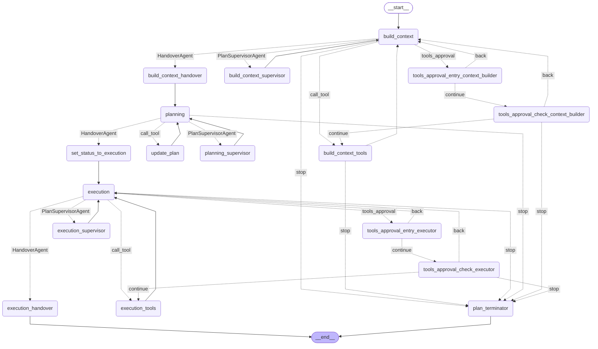
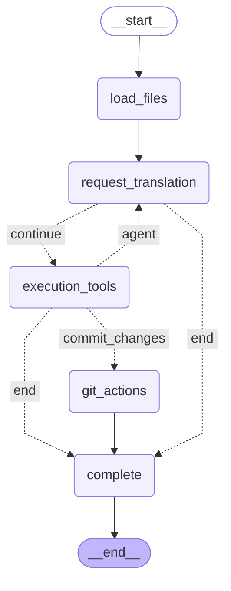
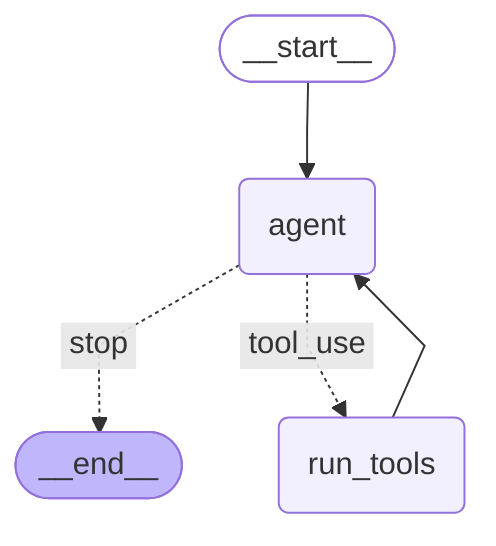
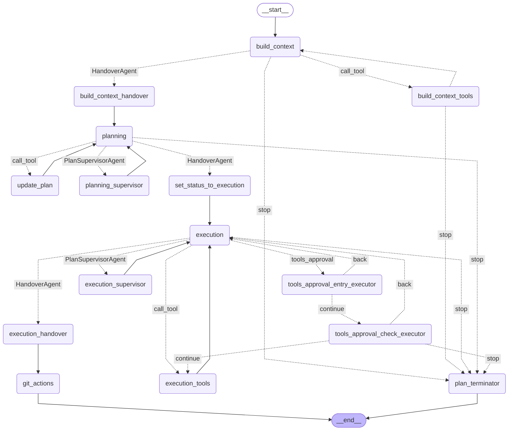

# Duo Workflow Service Graphs

These diagrams show the LangGraph structure of each Workflow in the duo_workflow_service. Do not manually edit
this file, instead update it by running `make duo-workflow-docs`.

## Graph: `software_development`

## Graph: `convert_to_gitlab_ci`

## Graph: `chat`

## Graph: `issue_to_merge_request`

