# Duo Workflow Service Graphs

These diagrams show the LangGraph structure of each Workflow in the duo_workflow_service. Do not manually edit
this file, instead update it by running `make duo-workflow-docs`.

[[_TOC_]]

## Graph: `software_development`

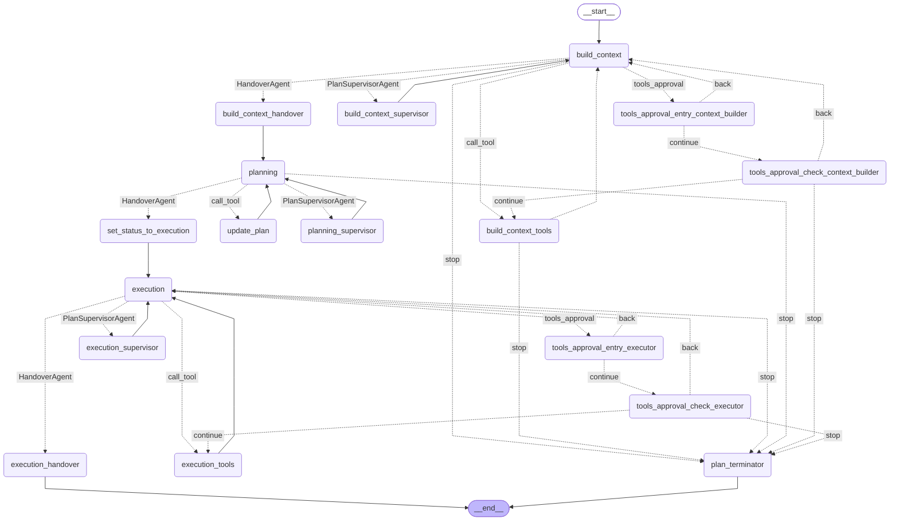
```mermaid
---
config:
  flowchart:
    curve: linear
---
graph TD;
    __start__([<p>__start__</p>]):::first
    build_context(build_context)
    build_context_tools(build_context_tools)
    build_context_handover(build_context_handover)
    build_context_supervisor(build_context_supervisor)
    tools_approval_entry_context_builder(tools_approval_entry_context_builder)
    tools_approval_check_context_builder(tools_approval_check_context_builder)
    planning(planning)
    update_plan(update_plan)
    planning_supervisor(planning_supervisor)
    plan_terminator(plan_terminator)
    set_status_to_execution(set_status_to_execution)
    execution(execution)
    tools_approval_entry_executor(tools_approval_entry_executor)
    tools_approval_check_executor(tools_approval_check_executor)
    execution_tools(execution_tools)
    execution_supervisor(execution_supervisor)
    execution_handover(execution_handover)
    __end__([<p>__end__</p>]):::last
    __start__ --> build_context;
    build_context -. &nbsp;HandoverAgent&nbsp; .-> build_context_handover;
    build_context -. &nbsp;PlanSupervisorAgent&nbsp; .-> build_context_supervisor;
    build_context -. &nbsp;call_tool&nbsp; .-> build_context_tools;
    build_context -. &nbsp;stop&nbsp; .-> plan_terminator;
    build_context -. &nbsp;tools_approval&nbsp; .-> tools_approval_entry_context_builder;
    build_context_handover --> planning;
    build_context_supervisor --> build_context;
    build_context_tools -.-> build_context;
    build_context_tools -. &nbsp;stop&nbsp; .-> plan_terminator;
    execution -. &nbsp;HandoverAgent&nbsp; .-> execution_handover;
    execution -. &nbsp;PlanSupervisorAgent&nbsp; .-> execution_supervisor;
    execution -. &nbsp;call_tool&nbsp; .-> execution_tools;
    execution -. &nbsp;stop&nbsp; .-> plan_terminator;
    execution -. &nbsp;tools_approval&nbsp; .-> tools_approval_entry_executor;
    execution_supervisor --> execution;
    execution_tools --> execution;
    planning -. &nbsp;stop&nbsp; .-> plan_terminator;
    planning -. &nbsp;PlanSupervisorAgent&nbsp; .-> planning_supervisor;
    planning -. &nbsp;HandoverAgent&nbsp; .-> set_status_to_execution;
    planning -. &nbsp;call_tool&nbsp; .-> update_plan;
    planning_supervisor --> planning;
    set_status_to_execution --> execution;
    tools_approval_check_context_builder -. &nbsp;back&nbsp; .-> build_context;
    tools_approval_check_context_builder -. &nbsp;continue&nbsp; .-> build_context_tools;
    tools_approval_check_context_builder -. &nbsp;stop&nbsp; .-> plan_terminator;
    tools_approval_check_executor -. &nbsp;back&nbsp; .-> execution;
    tools_approval_check_executor -. &nbsp;continue&nbsp; .-> execution_tools;
    tools_approval_check_executor -. &nbsp;stop&nbsp; .-> plan_terminator;
    tools_approval_entry_context_builder -. &nbsp;back&nbsp; .-> build_context;
    tools_approval_entry_context_builder -. &nbsp;continue&nbsp; .-> tools_approval_check_context_builder;
    tools_approval_entry_executor -. &nbsp;back&nbsp; .-> execution;
    tools_approval_entry_executor -. &nbsp;continue&nbsp; .-> tools_approval_check_executor;
    update_plan --> planning;
    execution_handover --> __end__;
    plan_terminator --> __end__;
    classDef default fill:#f2f0ff,line-height:1.2
    classDef first fill-opacity:0
    classDef last fill:#bfb6fc
```

## Graph: `convert_to_gitlab_ci`

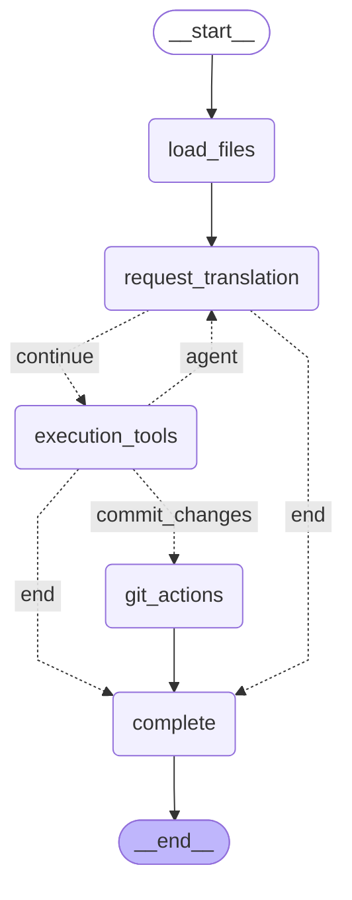
```mermaid
---
config:
  flowchart:
    curve: linear
---
graph TD;
    __start__([<p>__start__</p>]):::first
    load_files(load_files)
    request_translation(request_translation)
    execution_tools(execution_tools)
    git_actions(git_actions)
    complete(complete)
    __end__([<p>__end__</p>]):::last
    __start__ --> load_files;
    execution_tools -. &nbsp;end&nbsp; .-> complete;
    execution_tools -. &nbsp;commit_changes&nbsp; .-> git_actions;
    execution_tools -. &nbsp;agent&nbsp; .-> request_translation;
    git_actions --> complete;
    load_files --> request_translation;
    request_translation -. &nbsp;end&nbsp; .-> complete;
    request_translation -. &nbsp;continue&nbsp; .-> execution_tools;
    complete --> __end__;
    classDef default fill:#f2f0ff,line-height:1.2
    classDef first fill-opacity:0
    classDef last fill:#bfb6fc
```

## Graph: `chat`

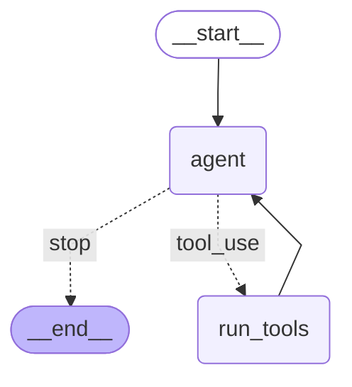
```mermaid
---
config:
  flowchart:
    curve: linear
---
graph TD;
    __start__([<p>__start__</p>]):::first
    agent(agent)
    run_tools(run_tools)
    __end__([<p>__end__</p>]):::last
    __start__ --> agent;
    agent -. &nbsp;stop&nbsp; .-> __end__;
    agent -. &nbsp;tool_use&nbsp; .-> run_tools;
    run_tools --> agent;
    classDef default fill:#f2f0ff,line-height:1.2
    classDef first fill-opacity:0
    classDef last fill:#bfb6fc
```

## Graph: `issue_to_merge_request`

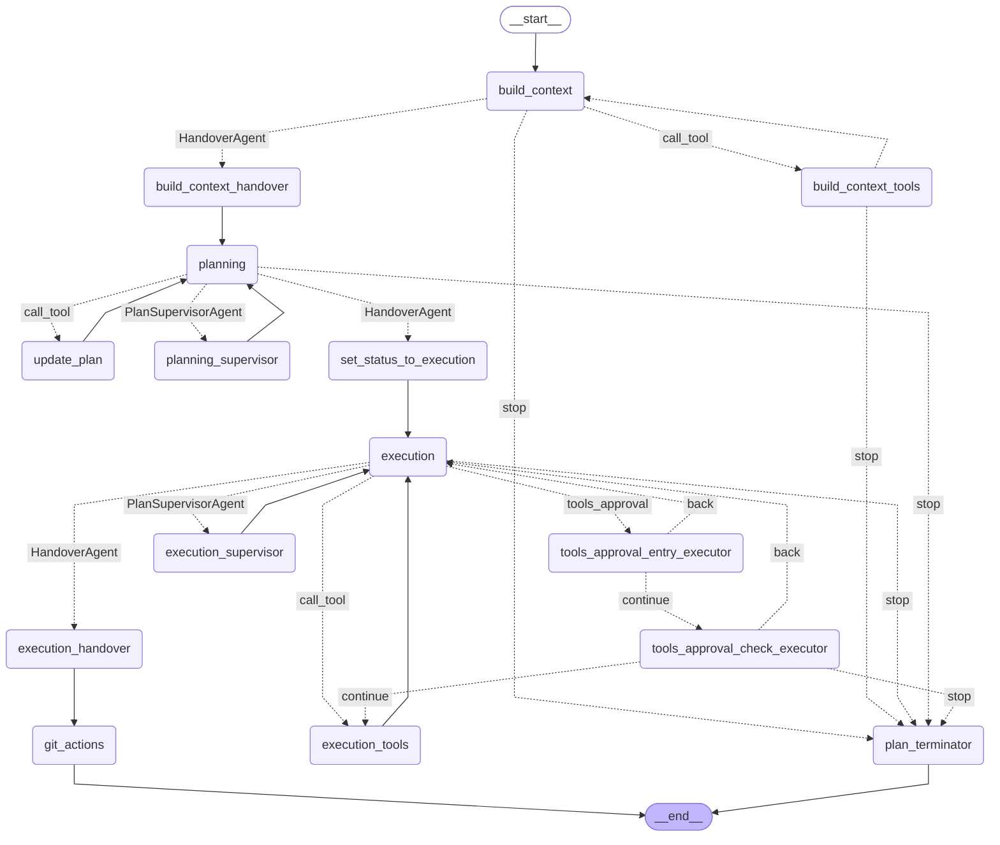
```mermaid
---
config:
  flowchart:
    curve: linear
---
graph TD;
    __start__([<p>__start__</p>]):::first
    build_context(build_context)
    build_context_tools(build_context_tools)
    build_context_handover(build_context_handover)
    planning(planning)
    update_plan(update_plan)
    planning_supervisor(planning_supervisor)
    plan_terminator(plan_terminator)
    set_status_to_execution(set_status_to_execution)
    execution(execution)
    tools_approval_entry_executor(tools_approval_entry_executor)
    tools_approval_check_executor(tools_approval_check_executor)
    execution_tools(execution_tools)
    execution_supervisor(execution_supervisor)
    execution_handover(execution_handover)
    git_actions(git_actions)
    __end__([<p>__end__</p>]):::last
    __start__ --> build_context;
    build_context -. &nbsp;HandoverAgent&nbsp; .-> build_context_handover;
    build_context -. &nbsp;call_tool&nbsp; .-> build_context_tools;
    build_context -. &nbsp;stop&nbsp; .-> plan_terminator;
    build_context_handover --> planning;
    build_context_tools -.-> build_context;
    build_context_tools -. &nbsp;stop&nbsp; .-> plan_terminator;
    execution -. &nbsp;HandoverAgent&nbsp; .-> execution_handover;
    execution -. &nbsp;PlanSupervisorAgent&nbsp; .-> execution_supervisor;
    execution -. &nbsp;call_tool&nbsp; .-> execution_tools;
    execution -. &nbsp;stop&nbsp; .-> plan_terminator;
    execution -. &nbsp;tools_approval&nbsp; .-> tools_approval_entry_executor;
    execution_handover --> git_actions;
    execution_supervisor --> execution;
    execution_tools --> execution;
    planning -. &nbsp;stop&nbsp; .-> plan_terminator;
    planning -. &nbsp;PlanSupervisorAgent&nbsp; .-> planning_supervisor;
    planning -. &nbsp;HandoverAgent&nbsp; .-> set_status_to_execution;
    planning -. &nbsp;call_tool&nbsp; .-> update_plan;
    planning_supervisor --> planning;
    set_status_to_execution --> execution;
    tools_approval_check_executor -. &nbsp;back&nbsp; .-> execution;
    tools_approval_check_executor -. &nbsp;continue&nbsp; .-> execution_tools;
    tools_approval_check_executor -. &nbsp;stop&nbsp; .-> plan_terminator;
    tools_approval_entry_executor -. &nbsp;back&nbsp; .-> execution;
    tools_approval_entry_executor -. &nbsp;continue&nbsp; .-> tools_approval_check_executor;
    update_plan --> planning;
    git_actions --> __end__;
    plan_terminator --> __end__;
    classDef default fill:#f2f0ff,line-height:1.2
    classDef first fill-opacity:0
    classDef last fill:#bfb6fc
```

## Graph: `business_context_security_guidelines 1.0.0 (experimental)` (Flow Registry)

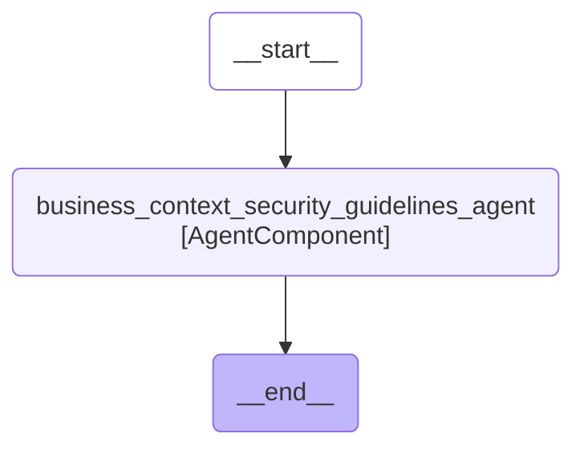
```mermaid
---
config:
    flowchart:
        curve: linear
---
graph TD;
    __start__(__start__):::first;
    __end__(__end__):::last;
    __start__ --> business_context_security_guidelines_agent;
    business_context_security_guidelines_agent(business_context_security_guidelines_agent<br>#91;AgentComponent#93;);
    business_context_security_guidelines_agent --> __end__;
    classDef default fill:#f2f0ff,line-height:1.2;
    classDef first fill-opacity:0;
    classDef last fill:#bfb6fc;
```

## Graph: `developer 1.0.0 (experimental)` (Flow Registry)

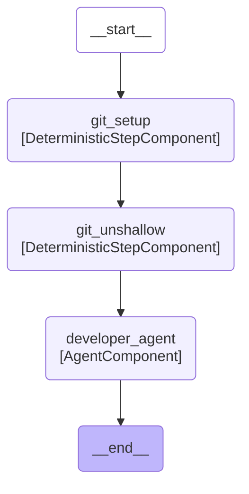
```mermaid
---
config:
    flowchart:
        curve: linear
---
graph TD;
    __start__(__start__):::first;
    __end__(__end__):::last;
    __start__ --> git_setup;
    git_setup(git_setup<br>#91;DeterministicStepComponent#93;);
    git_unshallow(git_unshallow<br>#91;DeterministicStepComponent#93;);
    developer_agent(developer_agent<br>#91;AgentComponent#93;);
    git_setup --> git_unshallow;
    git_unshallow --> developer_agent;
    developer_agent --> __end__;
    classDef default fill:#f2f0ff,line-height:1.2;
    classDef first fill-opacity:0;
    classDef last fill:#bfb6fc;
```

## Graph: `resolve_dependency_bump 1.0.0 (experimental)` (Flow Registry)

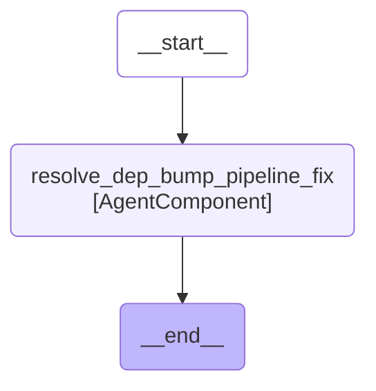
```mermaid
---
config:
    flowchart:
        curve: linear
---
graph TD;
    __start__(__start__):::first;
    __end__(__end__):::last;
    __start__ --> resolve_dep_bump_pipeline_fix;
    resolve_dep_bump_pipeline_fix(resolve_dep_bump_pipeline_fix<br>#91;AgentComponent#93;);
    resolve_dep_bump_pipeline_fix --> __end__;
    classDef default fill:#f2f0ff,line-height:1.2;
    classDef first fill-opacity:0;
    classDef last fill:#bfb6fc;
```

## Graph: `agentic_chat 1.0.0 (v1)` (Flow Registry)

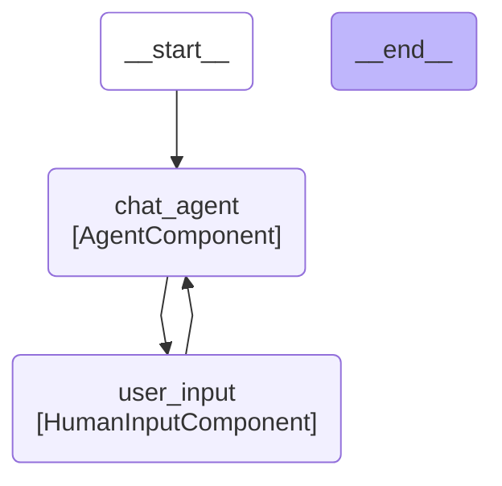
```mermaid
---
config:
    flowchart:
        curve: linear
---
graph TD;
    __start__(__start__):::first;
    __end__(__end__):::last;
    __start__ --> chat_agent;
    chat_agent(chat_agent<br>#91;AgentComponent#93;);
    user_input(user_input<br>#91;HumanInputComponent#93;);
    chat_agent --> user_input;
    user_input --> chat_agent;
    classDef default fill:#f2f0ff,line-height:1.2;
    classDef first fill-opacity:0;
    classDef last fill:#bfb6fc;
```

## Graph: `analytics_agent 1.0.0 (v1)` (Flow Registry)

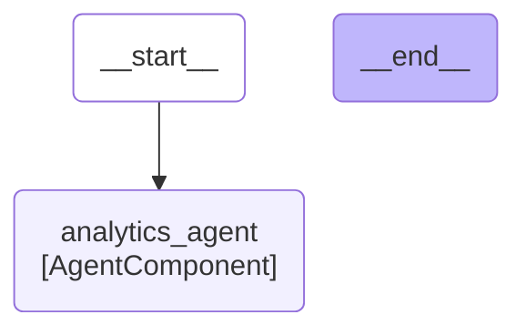
```mermaid
---
config:
    flowchart:
        curve: linear
---
graph TD;
    __start__(__start__):::first;
    __end__(__end__):::last;
    __start__ --> analytics_agent;
    analytics_agent(analytics_agent<br>#91;AgentComponent#93;);
    classDef default fill:#f2f0ff,line-height:1.2;
    classDef first fill-opacity:0;
    classDef last fill:#bfb6fc;
```

## Graph: `code_review 1.0.0 (v1)` (Flow Registry)

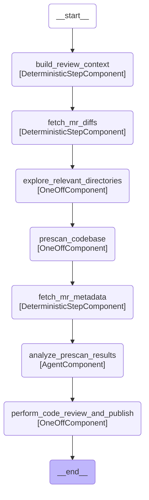
```mermaid
---
config:
    flowchart:
        curve: linear
---
graph TD;
    __start__(__start__):::first;
    __end__(__end__):::last;
    __start__ --> build_review_context;
    build_review_context(build_review_context<br>#91;DeterministicStepComponent#93;);
    fetch_mr_diffs(fetch_mr_diffs<br>#91;DeterministicStepComponent#93;);
    explore_relevant_directories(explore_relevant_directories<br>#91;OneOffComponent#93;);
    prescan_codebase(prescan_codebase<br>#91;OneOffComponent#93;);
    fetch_mr_metadata(fetch_mr_metadata<br>#91;DeterministicStepComponent#93;);
    analyze_prescan_results(analyze_prescan_results<br>#91;AgentComponent#93;);
    perform_code_review_and_publish(perform_code_review_and_publish<br>#91;OneOffComponent#93;);
    build_review_context --> fetch_mr_diffs;
    fetch_mr_diffs --> explore_relevant_directories;
    explore_relevant_directories --> prescan_codebase;
    prescan_codebase --> fetch_mr_metadata;
    fetch_mr_metadata --> analyze_prescan_results;
    analyze_prescan_results --> perform_code_review_and_publish;
    perform_code_review_and_publish --> __end__;
    classDef default fill:#f2f0ff,line-height:1.2;
    classDef first fill-opacity:0;
    classDef last fill:#bfb6fc;
```

## Graph: `convert_to_gl_ci 1.0.0 (v1)` (Flow Registry)

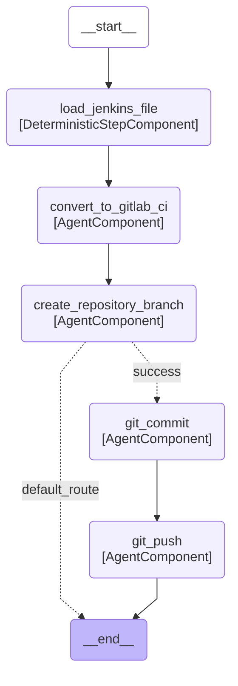
```mermaid
---
config:
    flowchart:
        curve: linear
---
graph TD;
    __start__(__start__):::first;
    __end__(__end__):::last;
    __start__ --> load_jenkins_file;
    load_jenkins_file(load_jenkins_file<br>#91;DeterministicStepComponent#93;);
    convert_to_gitlab_ci(convert_to_gitlab_ci<br>#91;AgentComponent#93;);
    create_repository_branch(create_repository_branch<br>#91;AgentComponent#93;);
    git_commit(git_commit<br>#91;AgentComponent#93;);
    git_push(git_push<br>#91;AgentComponent#93;);
    load_jenkins_file --> convert_to_gitlab_ci;
    convert_to_gitlab_ci --> create_repository_branch;
    create_repository_branch -.->|success| git_commit;
    create_repository_branch -.->|default_route| __end__;
    git_commit --> git_push;
    git_push --> __end__;
    classDef default fill:#f2f0ff,line-height:1.2;
    classDef first fill-opacity:0;
    classDef last fill:#bfb6fc;
```

## Graph: `developer 1.0.0 (v1)` (Flow Registry)

```mermaid
---
config:
    flowchart:
        curve: linear
---
graph TD;
    __start__(__start__):::first;
    __end__(__end__):::last;
    __start__ --> git_setup;
    git_setup(git_setup<br>#91;DeterministicStepComponent#93;);
    git_unshallow(git_unshallow<br>#91;DeterministicStepComponent#93;);
    developer_agent(developer_agent<br>#91;AgentComponent#93;);
    git_setup --> git_unshallow;
    git_unshallow --> developer_agent;
    developer_agent --> __end__;
    classDef default fill:#f2f0ff,line-height:1.2;
    classDef first fill-opacity:0;
    classDef last fill:#bfb6fc;
```

## Graph: `developer 2.0.0-local (v1)` (Flow Registry)

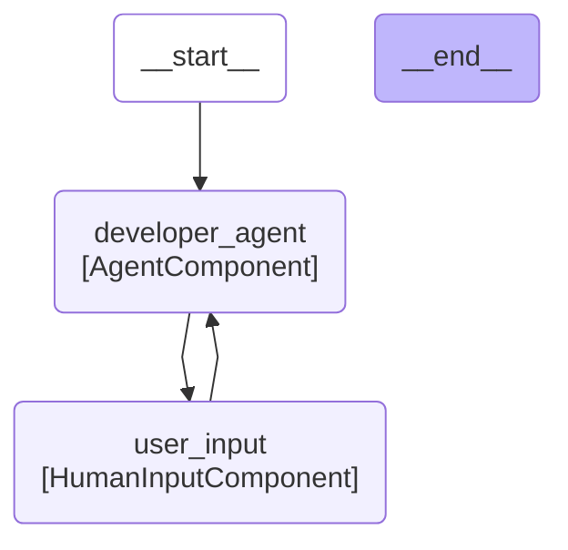
```mermaid
---
config:
    flowchart:
        curve: linear
---
graph TD;
    __start__(__start__):::first;
    __end__(__end__):::last;
    __start__ --> developer_agent;
    developer_agent(developer_agent<br>#91;AgentComponent#93;);
    user_input(user_input<br>#91;HumanInputComponent#93;);
    developer_agent --> user_input;
    user_input --> developer_agent;
    classDef default fill:#f2f0ff,line-height:1.2;
    classDef first fill-opacity:0;
    classDef last fill:#bfb6fc;
```

## Graph: `developer 2.0.0-orbit (v1)` (Flow Registry)

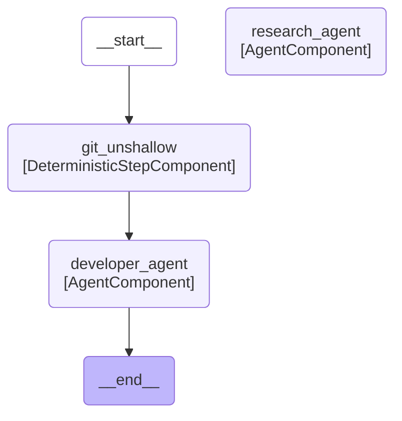
```mermaid
---
config:
    flowchart:
        curve: linear
---
graph TD;
    __start__(__start__):::first;
    __end__(__end__):::last;
    __start__ --> git_unshallow;
    git_unshallow(git_unshallow<br>#91;DeterministicStepComponent#93;);
    developer_agent(developer_agent<br>#91;AgentComponent#93;);
    research_agent(research_agent<br>#91;AgentComponent#93;);
    git_unshallow --> developer_agent;
    developer_agent --> __end__;
    classDef default fill:#f2f0ff,line-height:1.2;
    classDef first fill-opacity:0;
    classDef last fill:#bfb6fc;
```

## Graph: `developer 2.0.0 (v1)` (Flow Registry)

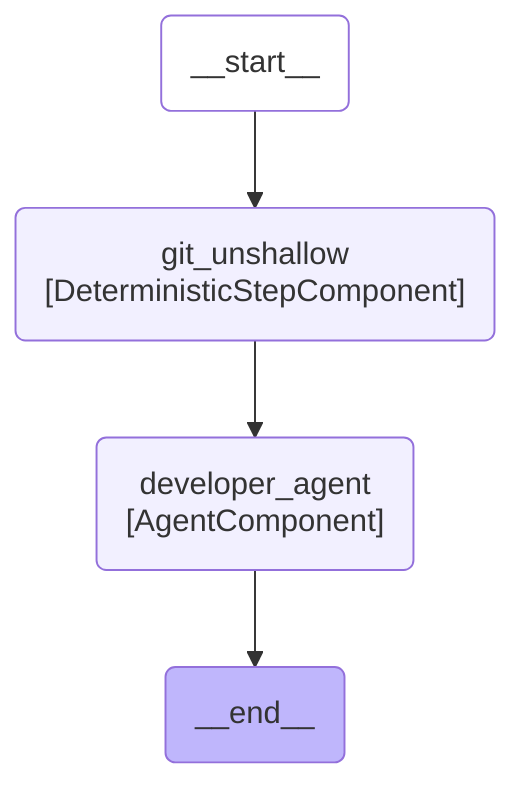
```mermaid
---
config:
    flowchart:
        curve: linear
---
graph TD;
    __start__(__start__):::first;
    __end__(__end__):::last;
    __start__ --> git_unshallow;
    git_unshallow(git_unshallow<br>#91;DeterministicStepComponent#93;);
    developer_agent(developer_agent<br>#91;AgentComponent#93;);
    git_unshallow --> developer_agent;
    developer_agent --> __end__;
    classDef default fill:#f2f0ff,line-height:1.2;
    classDef first fill-opacity:0;
    classDef last fill:#bfb6fc;
```

## Graph: `duo_permissions_assistant 1.0.0 (v1)` (Flow Registry)

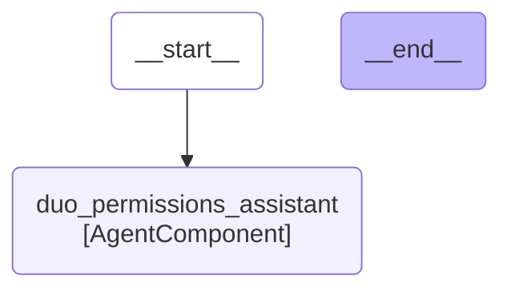
```mermaid
---
config:
    flowchart:
        curve: linear
---
graph TD;
    __start__(__start__):::first;
    __end__(__end__):::last;
    __start__ --> duo_permissions_assistant;
    duo_permissions_assistant(duo_permissions_assistant<br>#91;AgentComponent#93;);
    classDef default fill:#f2f0ff,line-height:1.2;
    classDef first fill-opacity:0;
    classDef last fill:#bfb6fc;
```

## Graph: `duo_permissions_assistant 2.0.0 (v1)` (Flow Registry)

```mermaid
---
config:
    flowchart:
        curve: linear
---
graph TD;
    __start__(__start__):::first;
    __end__(__end__):::last;
    __start__ --> duo_permissions_assistant;
    duo_permissions_assistant(duo_permissions_assistant<br>#91;AgentComponent#93;);
    classDef default fill:#f2f0ff,line-height:1.2;
    classDef first fill-opacity:0;
    classDef last fill:#bfb6fc;
```

## Graph: `fix_pipeline 1.0.0 (v1)` (Flow Registry)

```mermaid
---
config:
    flowchart:
        curve: linear
---
graph TD;
    __start__(__start__):::first;
    __end__(__end__):::last;
    __start__ --> fetch_failing_jobs;
    fetch_failing_jobs(fetch_failing_jobs<br>#91;DeterministicStepComponent#93;);
    fetch_failing_bridge_jobs(fetch_failing_bridge_jobs<br>#91;DeterministicStepComponent#93;);
    fetch_mr_diffs(fetch_mr_diffs<br>#91;DeterministicStepComponent#93;);
    fix_pipeline_context(fix_pipeline_context<br>#91;AgentComponent#93;);
    fix_pipeline_decide_fix(fix_pipeline_decide_fix<br>#91;AgentComponent#93;);
    fix_pipeline_code_suggestions(fix_pipeline_code_suggestions<br>#91;AgentComponent#93;);
    fix_pipeline_add_comment(fix_pipeline_add_comment<br>#91;AgentComponent#93;);
    git_fetch_for_branch(git_fetch_for_branch<br>#91;DeterministicStepComponent#93;);
    fix_pipeline_create_branch(fix_pipeline_create_branch<br>#91;AgentComponent#93;);
    fix_pipeline_checkout_existing_branch(fix_pipeline_checkout_existing_branch<br>#91;AgentComponent#93;);
    fix_pipeline_check_diff(fix_pipeline_check_diff<br>#91;DeterministicStepComponent#93;);
    fix_pipeline_execution(fix_pipeline_execution<br>#91;AgentComponent#93;);
    fix_pipeline_git_commit(fix_pipeline_git_commit<br>#91;AgentComponent#93;);
    git_fetch_unshallow(git_fetch_unshallow<br>#91;DeterministicStepComponent#93;);
    git_push_branch(git_push_branch<br>#91;DeterministicStepComponent#93;);
    fix_pipeline_create_new_mr(fix_pipeline_create_new_mr<br>#91;OneOffComponent#93;);
    fetch_failing_jobs --> fetch_failing_bridge_jobs;
    fetch_failing_bridge_jobs -.->|| fix_pipeline_context;
    fetch_failing_bridge_jobs -.->|default_route| fetch_mr_diffs;
    fetch_mr_diffs --> fix_pipeline_context;
    fix_pipeline_context -.->|add_comment| fix_pipeline_add_comment;
    fix_pipeline_context -.->|create_plan| fix_pipeline_checkout_existing_branch;
    fix_pipeline_context -.->|direct_code_suggestions| fix_pipeline_code_suggestions;
    fix_pipeline_context -.->|no_action| __end__;
    fix_pipeline_context -.->|default_route| __end__;
    fix_pipeline_checkout_existing_branch --> fix_pipeline_execution;
    fix_pipeline_add_comment --> __end__;
    fix_pipeline_execution --> fix_pipeline_check_diff;
    fix_pipeline_check_diff --> fix_pipeline_decide_fix;
    fix_pipeline_decide_fix -.->|create_fix_on_existing_mr| fix_pipeline_code_suggestions;
    fix_pipeline_decide_fix -.->|create_fix_on_new_mr| git_fetch_for_branch;
    fix_pipeline_decide_fix -.->|no_action_needed| __end__;
    fix_pipeline_decide_fix -.->|default_route| git_fetch_for_branch;
    fix_pipeline_code_suggestions --> __end__;
    git_fetch_for_branch --> fix_pipeline_create_branch;
    fix_pipeline_create_branch -.->|success| fix_pipeline_git_commit;
    fix_pipeline_create_branch -.->|default_route| __end__;
    fix_pipeline_git_commit --> git_fetch_unshallow;
    git_fetch_unshallow --> git_push_branch;
    git_push_branch -.->|failed| __end__;
    git_push_branch -.->|default_route| fix_pipeline_create_new_mr;
    fix_pipeline_create_new_mr --> __end__;
    classDef default fill:#f2f0ff,line-height:1.2;
    classDef first fill-opacity:0;
    classDef last fill:#bfb6fc;
```

## Graph: `fix_pipeline_next 1.0.0 (v1)` (Flow Registry)

```mermaid
---
config:
    flowchart:
        curve: linear
---
graph TD;
    __start__(__start__):::first;
    __end__(__end__):::last;
    __start__ --> fetch_failing_jobs;
    fetch_failing_jobs(fetch_failing_jobs<br>#91;DeterministicStepComponent#93;);
    fetch_failing_bridge_jobs(fetch_failing_bridge_jobs<br>#91;DeterministicStepComponent#93;);
    fetch_mr_diffs(fetch_mr_diffs<br>#91;DeterministicStepComponent#93;);
    fix_pipeline_next_context(fix_pipeline_next_context<br>#91;AgentComponent#93;);
    fix_pipeline_next_decide_fix(fix_pipeline_next_decide_fix<br>#91;AgentComponent#93;);
    fix_pipeline_next_code_suggestions(fix_pipeline_next_code_suggestions<br>#91;AgentComponent#93;);
    fix_pipeline_add_comment(fix_pipeline_add_comment<br>#91;AgentComponent#93;);
    git_fetch_for_branch(git_fetch_for_branch<br>#91;DeterministicStepComponent#93;);
    fix_pipeline_next_create_branch(fix_pipeline_next_create_branch<br>#91;AgentComponent#93;);
    fix_pipeline_next_checkout_existing_branch(fix_pipeline_next_checkout_existing_branch<br>#91;AgentComponent#93;);
    fix_pipeline_next_check_diff(fix_pipeline_next_check_diff<br>#91;DeterministicStepComponent#93;);
    fix_pipeline_next_execution(fix_pipeline_next_execution<br>#91;AgentComponent#93;);
    fix_pipeline_git_commit(fix_pipeline_git_commit<br>#91;AgentComponent#93;);
    git_fetch_unshallow(git_fetch_unshallow<br>#91;DeterministicStepComponent#93;);
    git_push_branch(git_push_branch<br>#91;DeterministicStepComponent#93;);
    fix_pipeline_next_create_new_mr(fix_pipeline_next_create_new_mr<br>#91;OneOffComponent#93;);
    fetch_failing_jobs --> fetch_failing_bridge_jobs;
    fetch_failing_bridge_jobs -.->|| fix_pipeline_next_context;
    fetch_failing_bridge_jobs -.->|default_route| fetch_mr_diffs;
    fetch_mr_diffs --> fix_pipeline_next_context;
    fix_pipeline_next_context -.->|add_comment| fix_pipeline_add_comment;
    fix_pipeline_next_context -.->|create_plan| fix_pipeline_next_checkout_existing_branch;
    fix_pipeline_next_context -.->|direct_code_suggestions| fix_pipeline_next_code_suggestions;
    fix_pipeline_next_context -.->|no_action| __end__;
    fix_pipeline_next_context -.->|default_route| __end__;
    fix_pipeline_next_checkout_existing_branch --> fix_pipeline_next_execution;
    fix_pipeline_add_comment --> __end__;
    fix_pipeline_next_execution --> fix_pipeline_next_check_diff;
    fix_pipeline_next_check_diff --> fix_pipeline_next_decide_fix;
    fix_pipeline_next_decide_fix -.->|create_fix_on_existing_mr| fix_pipeline_next_code_suggestions;
    fix_pipeline_next_decide_fix -.->|create_fix_on_new_mr| git_fetch_for_branch;
    fix_pipeline_next_decide_fix -.->|no_action_needed| __end__;
    fix_pipeline_next_decide_fix -.->|default_route| git_fetch_for_branch;
    fix_pipeline_next_code_suggestions --> __end__;
    git_fetch_for_branch --> fix_pipeline_next_create_branch;
    fix_pipeline_next_create_branch -.->|success| fix_pipeline_git_commit;
    fix_pipeline_next_create_branch -.->|default_route| __end__;
    fix_pipeline_git_commit --> git_fetch_unshallow;
    git_fetch_unshallow --> git_push_branch;
    git_push_branch -.->|failed| __end__;
    git_push_branch -.->|default_route| fix_pipeline_next_create_new_mr;
    fix_pipeline_next_create_new_mr --> __end__;
    classDef default fill:#f2f0ff,line-height:1.2;
    classDef first fill-opacity:0;
    classDef last fill:#bfb6fc;
```

## Graph: `gitlab_duo_mention_assistant 1.0.0 (v1)` (Flow Registry)

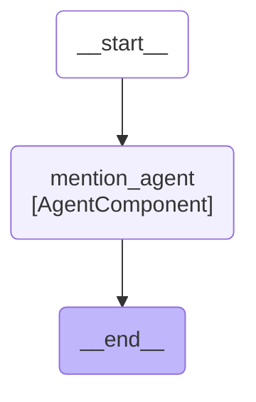
```mermaid
---
config:
    flowchart:
        curve: linear
---
graph TD;
    __start__(__start__):::first;
    __end__(__end__):::last;
    __start__ --> mention_agent;
    mention_agent(mention_agent<br>#91;AgentComponent#93;);
    mention_agent --> __end__;
    classDef default fill:#f2f0ff,line-height:1.2;
    classDef first fill-opacity:0;
    classDef last fill:#bfb6fc;
```

## Graph: `orbit_agent 1.0.0 (v1)` (Flow Registry)

```mermaid
---
config:
    flowchart:
        curve: linear
---
graph TD;
    __start__(__start__):::first;
    __end__(__end__):::last;
    __start__ --> orbit_agent;
    orbit_agent(orbit_agent<br>#91;AgentComponent#93;);
    classDef default fill:#f2f0ff,line-height:1.2;
    classDef first fill-opacity:0;
    classDef last fill:#bfb6fc;
```

## Graph: `project_activity 1.0.0 (v1)` (Flow Registry)

```mermaid
---
config:
    flowchart:
        curve: linear
---
graph TD;
    __start__(__start__):::first;
    __end__(__end__):::last;
    __start__ --> fetch_new_issues;
    fetch_new_issues(fetch_new_issues<br>#91;AgentComponent#93;);
    fetch_closed_issues(fetch_closed_issues<br>#91;AgentComponent#93;);
    fetch_updated_issues(fetch_updated_issues<br>#91;AgentComponent#93;);
    fetch_new_merge_requests(fetch_new_merge_requests<br>#91;AgentComponent#93;);
    fetch_closed_merge_requests(fetch_closed_merge_requests<br>#91;AgentComponent#93;);
    fetch_updated_merge_requests(fetch_updated_merge_requests<br>#91;AgentComponent#93;);
    summarize_activity(summarize_activity<br>#91;AgentComponent#93;);
    create_summary_issue(create_summary_issue<br>#91;AgentComponent#93;);
    fetch_new_issues --> fetch_closed_issues;
    fetch_closed_issues --> fetch_updated_issues;
    fetch_updated_issues --> fetch_new_merge_requests;
    fetch_new_merge_requests --> fetch_closed_merge_requests;
    fetch_closed_merge_requests --> fetch_updated_merge_requests;
    fetch_updated_merge_requests --> summarize_activity;
    summarize_activity --> create_summary_issue;
    create_summary_issue --> __end__;
    classDef default fill:#f2f0ff,line-height:1.2;
    classDef first fill-opacity:0;
    classDef last fill:#bfb6fc;
```

## Graph: `recommend_reviewers 1.0.0 (v1)` (Flow Registry)

```mermaid
---
config:
    flowchart:
        curve: linear
---
graph TD;
    __start__(__start__):::first;
    __end__(__end__):::last;
    __start__ --> post_recommendation;
    post_recommendation(post_recommendation<br>#91;OneOffComponent#93;);
    assign_reviewers(assign_reviewers<br>#91;OneOffComponent#93;);
    post_recommendation --> assign_reviewers;
    assign_reviewers --> __end__;
    classDef default fill:#f2f0ff,line-height:1.2;
    classDef first fill-opacity:0;
    classDef last fill:#bfb6fc;
```

## Graph: `resolve_sast_vulnerability 1.0.0 (v1)` (Flow Registry)

```mermaid
---
config:
    flowchart:
        curve: linear
---
graph TD;
    __start__(__start__):::first;
    __end__(__end__):::last;
    __start__ --> gather_context;
    gather_context(gather_context<br>#91;DeterministicStepComponent#93;);
    evaluate_vuln_fp_status(evaluate_vuln_fp_status<br>#91;DeterministicStepComponent#93;);
    ensure_clean_git_state(ensure_clean_git_state<br>#91;AgentComponent#93;);
    create_repository_branch(create_repository_branch<br>#91;AgentComponent#93;);
    execute_fix(execute_fix<br>#91;AgentComponent#93;);
    validate_fix_has_changes(validate_fix_has_changes<br>#91;AgentComponent#93;);
    commit_changes(commit_changes<br>#91;OneOffComponent#93;);
    push_and_create_mr(push_and_create_mr<br>#91;OneOffComponent#93;);
    link_vulnerability(link_vulnerability<br>#91;DeterministicStepComponent#93;);
    evaluate_merge_request(evaluate_merge_request<br>#91;AgentComponent#93;);
    gather_context --> evaluate_vuln_fp_status;
    evaluate_vuln_fp_status -.->|skip_false_positive| __end__;
    evaluate_vuln_fp_status -.->|proceed_with_fix| ensure_clean_git_state;
    evaluate_vuln_fp_status -.->|default_route| ensure_clean_git_state;
    ensure_clean_git_state --> create_repository_branch;
    create_repository_branch -.->|success| execute_fix;
    create_repository_branch -.->|default_route| __end__;
    execute_fix --> validate_fix_has_changes;
    validate_fix_has_changes -.->|proceed| commit_changes;
    validate_fix_has_changes -.->|no_changes| __end__;
    validate_fix_has_changes -.->|default_route| __end__;
    commit_changes -.->|success| push_and_create_mr;
    commit_changes -.->|default_route| __end__;
    push_and_create_mr -.->|success| evaluate_merge_request;
    push_and_create_mr -.->|default_route| __end__;
    evaluate_merge_request --> link_vulnerability;
    link_vulnerability --> __end__;
    classDef default fill:#f2f0ff,line-height:1.2;
    classDef first fill-opacity:0;
    classDef last fill:#bfb6fc;
```

## Graph: `sast_fp_detection 1.0.0 (v1)` (Flow Registry)

```mermaid
---
config:
    flowchart:
        curve: linear
---
graph TD;
    __start__(__start__):::first;
    __end__(__end__):::last;
    __start__ --> sast_vulnerability_details_component;
    sast_vulnerability_details_component(sast_vulnerability_details_component<br>#91;DeterministicStepComponent#93;);
    validate_sast_vulnerability_component(validate_sast_vulnerability_component<br>#91;AgentComponent#93;);
    sast_vulnerability_source_file_component(sast_vulnerability_source_file_component<br>#91;OneOffComponent#93;);
    sast_vulnerability_lines_component(sast_vulnerability_lines_component<br>#91;OneOffComponent#93;);
    sast_vulnerability_report_component(sast_vulnerability_report_component<br>#91;AgentComponent#93;);
    sast_fp_detection_agent(sast_fp_detection_agent<br>#91;AgentComponent#93;);
    sast_post_results_to_gitlab_component(sast_post_results_to_gitlab_component<br>#91;OneOffComponent#93;);
    sast_vulnerability_details_component --> validate_sast_vulnerability_component;
    validate_sast_vulnerability_component -.->|valid| sast_vulnerability_source_file_component;
    validate_sast_vulnerability_component -.->|invalid| __end__;
    sast_vulnerability_source_file_component -.->|success| sast_vulnerability_lines_component;
    sast_vulnerability_source_file_component -.->|default_route| __end__;
    sast_vulnerability_lines_component -.->|success| sast_vulnerability_report_component;
    sast_vulnerability_lines_component -.->|default_route| __end__;
    sast_vulnerability_report_component --> sast_fp_detection_agent;
    sast_fp_detection_agent --> sast_post_results_to_gitlab_component;
    sast_post_results_to_gitlab_component --> __end__;
    classDef default fill:#f2f0ff,line-height:1.2;
    classDef first fill-opacity:0;
    classDef last fill:#bfb6fc;
```

## Graph: `secrets_fp_detection 1.0.0 (v1)` (Flow Registry)

```mermaid
---
config:
    flowchart:
        curve: linear
---
graph TD;
    __start__(__start__):::first;
    __end__(__end__):::last;
    __start__ --> secret_vulnerability_details_component;
    secret_vulnerability_details_component(secret_vulnerability_details_component<br>#91;DeterministicStepComponent#93;);
    secret_vulnerability_source_file_component(secret_vulnerability_source_file_component<br>#91;OneOffComponent#93;);
    secret_vulnerability_lines_component(secret_vulnerability_lines_component<br>#91;OneOffComponent#93;);
    secret_vulnerability_report_component(secret_vulnerability_report_component<br>#91;AgentComponent#93;);
    secret_fp_detection_agent(secret_fp_detection_agent<br>#91;AgentComponent#93;);
    secret_post_results_to_gitlab_component(secret_post_results_to_gitlab_component<br>#91;OneOffComponent#93;);
    secret_vulnerability_details_component --> secret_vulnerability_source_file_component;
    secret_vulnerability_source_file_component -.->|success| secret_vulnerability_lines_component;
    secret_vulnerability_source_file_component -.->|default_route| __end__;
    secret_vulnerability_lines_component -.->|success| secret_vulnerability_report_component;
    secret_vulnerability_lines_component -.->|default_route| __end__;
    secret_vulnerability_report_component --> secret_fp_detection_agent;
    secret_fp_detection_agent --> secret_post_results_to_gitlab_component;
    secret_post_results_to_gitlab_component --> __end__;
    classDef default fill:#f2f0ff,line-height:1.2;
    classDef first fill-opacity:0;
    classDef last fill:#bfb6fc;
```

## Graph: `security_review 1.0.0 (v1)` (Flow Registry)

```mermaid
---
config:
    flowchart:
        curve: linear
---
graph TD;
    __start__(__start__):::first;
    __end__(__end__):::last;
    __start__ --> check_existing_review;
    check_existing_review(check_existing_review<br>#91;DeterministicStepComponent#93;);
    apply_triggered_label(apply_triggered_label<br>#91;DeterministicStepComponent#93;);
    fetch_mr_data(fetch_mr_data<br>#91;DeterministicStepComponent#93;);
    build_review_context(build_review_context<br>#91;AgentComponent#93;);
    prescan_codebase(prescan_codebase<br>#91;AgentComponent#93;);
    perform_security_review(perform_security_review<br>#91;AgentComponent#93;);
    validate_and_publish(validate_and_publish<br>#91;AgentComponent#93;);
    apply_completed_label(apply_completed_label<br>#91;DeterministicStepComponent#93;);
    check_existing_review --> apply_triggered_label;
    apply_triggered_label --> fetch_mr_data;
    fetch_mr_data --> build_review_context;
    build_review_context --> prescan_codebase;
    prescan_codebase --> perform_security_review;
    perform_security_review --> validate_and_publish;
    validate_and_publish --> apply_completed_label;
    apply_completed_label --> __end__;
    classDef default fill:#f2f0ff,line-height:1.2;
    classDef first fill-opacity:0;
    classDef last fill:#bfb6fc;
```

## Graph: `software_development 1.0.0 (v1)` (Flow Registry)

```mermaid
---
config:
    flowchart:
        curve: linear
---
graph TD;
    __start__(__start__):::first;
    __end__(__end__):::last;
    __start__ --> context_builder;
    context_builder(context_builder<br>#91;AgentComponent#93;);
    planner(planner<br>#91;AgentComponent#93;);
    plan_approval(plan_approval<br>#91;HumanInputComponent#93;);
    executor(executor<br>#91;AgentComponent#93;);
    context_builder --> planner;
    planner --> plan_approval;
    plan_approval -.->|approve| executor;
    plan_approval -.->|modify| planner;
    plan_approval -.->|default_route| __end__;
    executor --> __end__;
    classDef default fill:#f2f0ff,line-height:1.2;
    classDef first fill-opacity:0;
    classDef last fill:#bfb6fc;
```

## Graph: `support_assistant 1.0.0 (v1)` (Flow Registry)

```mermaid
---
config:
    flowchart:
        curve: linear
---
graph TD;
    __start__(__start__):::first;
    __end__(__end__):::last;
    __start__ --> support_assistant;
    support_assistant(support_assistant<br>#91;AgentComponent#93;);
    classDef default fill:#f2f0ff,line-height:1.2;
    classDef first fill-opacity:0;
    classDef last fill:#bfb6fc;
```
