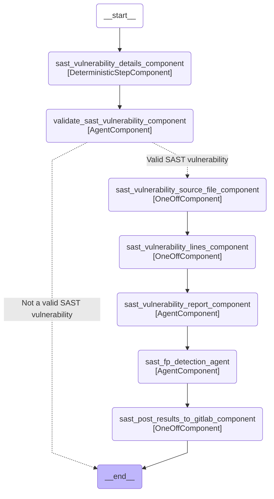

# Duo Workflow Service Graphs

These diagrams show the LangGraph structure of each Workflow in the duo_workflow_service. Do not manually edit
this file, instead update it by running `make duo-workflow-docs`.

[[_TOC_]]

## Graph: `software_development`

## Graph: `convert_to_gitlab_ci`

## Graph: `chat`

## Graph: `issue_to_merge_request`

## Graph: `developer/experimental` (Flow Registry)

## Graph: `analytics_agent/v1` (Flow Registry)

## Graph: `code_review/v1` (Flow Registry)

## Graph: `convert_to_gl_ci/v1` (Flow Registry)

## Graph: `developer/v1` (Flow Registry)

## Graph: `fix_pipeline/v1` (Flow Registry)

## Graph: `resolve_sast_vulnerability/v1` (Flow Registry)

## Graph: `sast_fp_detection/v1` (Flow Registry)

## Graph: `secrets_fp_detection/v1` (Flow Registry)

