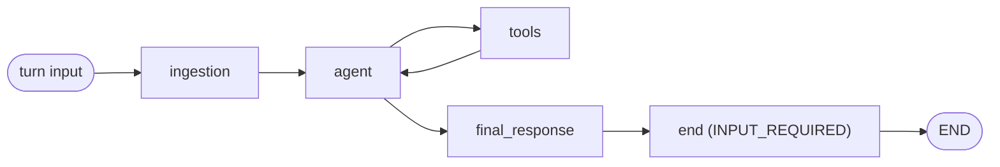

# Chat engine: the conversational boundary for chat-partial flows

Chat-partial flows run today on `chat.Workflow`, a separate executor with its own graph, state, and turn handling.
The chat engine replaces that executor with the Flow Registry's own. `Flow` and `FlowGraphBuilder` run the turn,
and a thin flow class, `ChatFlow`, owns the conversational boundary and nothing else.

This page is normative. It describes what the chat engine does and does not do once complete. It is revised by
merge request as decisions change.
Sequencing and rollout status live in
[ai-assist#2780](https://gitlab.com/gitlab-org/modelops/applied-ml/code-suggestions/ai-assist/-/work_items/2780).
The design record is
[ai-assist#2693](https://gitlab.com/gitlab-org/modelops/applied-ml/code-suggestions/ai-assist/-/work_items/2693).

[[_TOC_]]

## Model

The chat engine is a boundary policy over the shared executor, not a second engine.

- Every component is shared. `AgentComponent`, the tool nodes, approvals, compaction, and streaming are the same
  classes ambient flows use, unchanged.
- The graph is built by `FlowGraphBuilder` and run by `Flow`. `ChatFlow` subclasses `Flow` and overrides four seams.
- Nothing in the engine assumes a component count or a topology. Every mechanism on this page reads the declared
  graph and works on any shape. The chat-partial environment keeps its existing rule of one root `AgentComponent`.
  That rule belongs to the environment, not to the engine.

| Seam | `ChatFlow` decides |
|------|--------------------|
| `_graph_builder`: a builder subclass that seeds the terminal component and synthesizes routers | Where a turn ends |
| `_initial_entry_dispatch`: the structural dispatch strategy | Where a turn begins |
| Entry wiring: the builder seeds the ingestion node like the terminals, sets it as the entry point, and hops to the declared entry component | What crosses the line inbound |
| `get_graph_input`: the RECOVERY input, which rolls forward from the tip | What happens after a bad crossing |

## Invariants

1. **A turn is one invocation.** Each user message enters through ingestion as graph input, runs to `END`, and the
   session is at rest between turns.
1. **The terminal component commits the boundary.** The seeded terminal writes `INPUT_REQUIRED` as the last state
   update of the turn. A turn that stops before the terminal runs leaves the tip mid-turn, and recovery rolls
   forward from it.
1. **Mid-turn pauses are interrupts.** Tool approvals pause the turn with `interrupt()` and never end it.
   Clarifying-input gates, when they arrive, are elicitation
   ([epic &55](https://gitlab.com/groups/gitlab-org/modelops/applied-ml/code-suggestions/-/work_items/55)) under the
   same rule.
1. **Documented grain only.** Plain input starts turns and `Command(resume=)` answers interrupts. Nothing else is
   graph input.

One live turn per thread is a client contract, not an engine invariant. Nothing fences concurrent entry today, and
clients disable send while a turn runs. Admission, fencing, and zombie termination are out of scope for the chat
engine and are tracked in
[ai-assist#2877](https://gitlab.com/gitlab-org/modelops/applied-ml/code-suggestions/ai-assist/-/work_items/2877).

## Where a turn ends

The builder seeds terminal components for every flow. Authors never declare them. `ChatFlow`'s builder seeds `end`
as a terminal that writes `INPUT_REQUIRED` instead of `COMPLETED`. `abort` is unchanged.

Boundary-bound components are the sinks of the built graph:

- a component with a declared `to: end` router, or
- a component with no outgoing router.

Every sink receives a synthesized stock router to `end`. Declared routers, including conditional ones, attach exactly
as they do in ambient. A component followed by another component has a router and is not a sink. A graph with no
sinks is a loop, and validation rejects it with an error that names this rule. A component consumed as a subagent is
part of its supervisor and is not in the built graph.

The chat-partial environment rejects declared routers. Its one component is the sink.

The status write is the terminal's own node update. No component's node is wrapped or altered.



## Where a turn begins

Entry dispatch classifies every client event from the checkpoint tip and its pending writes. The Rails status is a
projection of the tip, reconciled toward it, and is never the source of classification.

| Tip | Event | Mode | Mechanism |
|-----|-------|------|-----------|
| No checkpoints | message | START | New invocation, graph input through ingestion |
| Boundary: `END` reached, `INPUT_REQUIRED`, nothing pending | message | TURN | New invocation from the tip, through ingestion |
| Pending `__interrupt__` writes | approval or rejection | RESUME | `Command(resume=)` |
| Mid-turn at rest | message | RECOVERY | Roll forward, see [Recovery](#recovery) |
| Pending `__interrupt__` writes | message | RECOVERY | Roll forward. The awaiting calls close as cancelled |
| Mid-turn at rest | reconnect, no message | RETRY | Replay from the tip, unchanged |
| Any checkpoint pinned by `resume_checkpoint_ts` | message | TURN | New invocation from the pinned checkpoint, through ingestion. LangGraph writes the fork checkpoint |
| Boundary, nothing pending | approval or rejection | REJECT | Stale event, structured error |

Dispatch is a strategy on the checkpointer. Every other flow keeps the default, `rails_status_dispatch`. `ChatFlow`
selects `structural_entry_dispatch`. TURN and RESUME project to the same wire event, so clients need no change.

## What crosses the line inbound

Ingestion runs once per turn as the first node, for the first message and the fortieth alike. The node owns
sequencing only. Each stage is a pure function in `duo_workflow_service/entities/message_ingestion.py` and its
sibling modules, and legacy `chat.Workflow` consumes the same stages.

1. Claim attachments out of `additional_context` (`category: attachments`) into content blocks. Attachments are
   message-scoped and never enter `context.inputs`.
1. Parse slash input for platform directives. `/compact` runs as a system turn: mutate state at a platform-owned node,
   write the UI log entry, reach the boundary. The engine renders no command macros. Slash text that is not a
   directive reaches the model unchanged.
1. Render the user message once. The rendered text is the `HumanMessage` content. Raw content and context ride in
   `additional_kwargs`.
1. Refresh envelope inputs into `context.inputs`, which is flow-scoped, through `Flow._process_additional_context`, so
   schema and version validation run with the refresh.
1. Normalize history: synthetic tool closures for dangling calls, budget reset, the USER UI log entry, internal
   events.

Rendering commands are templated by the client. The IDE webviews template the four flagship commands before the
cutover. The directive invocation surface belongs to the commands track.

## Recovery

A RECOVERY entry rolls forward. The tip is where the stopped turn left the session, and the next message enters
there through ingestion like any TURN. The normalization stage closes every call that never returned with a
cancelled tool result, and the turn runs.

Nothing is discarded, so there is no `cancelled_turn` envelope. The transcript the user saw is the transcript the
model sees. Recovery never forks.

A client-requested fork is not recovery. Manual retry pins an earlier checkpoint through `resume_checkpoint_ts`, and
the message enters as a TURN from there. A TURN is plain graph input, so LangGraph treats the pinned checkpoint as
[time travel](https://docs.langchain.com/oss/python/langgraph/use-time-travel#fork) and writes the fork checkpoint
before the first node runs.

## Selection and rollout

Engine selection is a registry-level table of engine-owned config versions, keyed by `config_id` and `version`, and
consulted by `flow_factory`. A listed version builds `ChatFlow`. Every other chat-partial version builds
`chat.Workflow`. No shipped version is listed at launch, so existing configs are unchanged by construction. An owner
moves a flow to the engine by shipping a new config version and listing it.

`agentic_chat/2.0.0` is the first listed version. It is reachable by explicit pin:

```shell
duo --flow-config-id agentic_chat --flow-version 2.0.0 --flow-config-schema-version v1
```

The single flagged change is routing definition `chat` to `agentic_chat/2.0.0` under
`engine_owned_chat_environment` (GitLab Rails [!250286](https://gitlab.com/gitlab-org/gitlab/-/merge_requests/250286)).
It requires per-session pinning, described under [Sessions in flight](#sessions-in-flight), and the IDE webviews
templating the four flagship commands.

## Configuration

Authors write the v1 config they write today. The engine adds no fields and removes none. Defaults the chat surface
guarantees are applied by load-time normalization of engine-owned configs, before the config reaches the engine.

| Field | When absent | When declared |
|-------|-------------|---------------|
| `ui_log_events` | `on_agent_final_answer`, `on_tool_execution_success`, `on_tool_execution_failed` | Declared values win. Legacy `chat.Workflow` ignores this field, so a declared subset restricts output on the engine. Owners see this change at their version swap. |
| `require_tool_approval` | `true` | Declared value |
| `pre_approved_tools` | Not applied | Not applied. Deprecated in [ai-assist#2744](https://gitlab.com/gitlab-org/modelops/applied-ml/code-suggestions/ai-assist/-/work_items/2744). |
| `compaction` | Engine defaults | Declared values |
| `max_cycles` | Engine default, reset at ingestion on every turn | Declared value, reset at ingestion on every turn |

File-based prompt references are a registry capability. A `prompts:` entry with `prompt_id` and a semver `version`
resolves the existing registry prompt with every model-family variant.

`agentic_chat/2.0.0`, abbreviated:

```yaml
version: "v1"
environment: chat-partial
name: "Agentic Chat"
description: "GitLab Duo Agentic Chat"
product_group: "agent_foundations"

components:
  - name: chat_agent
    type: AgentComponent
    prompt_id: chat_agent_prompt
    toolset:
      - get_project
      - gitlab_issue_search
      - read_file
      - create_merge_request
      # The full toolset is in the config file.

prompts:
  - name: chat_agent_prompt
    prompt_id: "chat/agent"
    version: "^1.0.0"
    unit_primitives: [duo_chat]
```

## Sessions in flight

A session created on `chat.Workflow` and resumed on the engine would classify as TURN and read its history under the
wrong key. Three layers prevent that, in order:

1. **Guard.** `ChatFlow` rejects a tip whose channels or node names are not the engine's, with a user-facing error to
   start a new chat. Ships with the engine.
1. **Pin.** Rails stores the resolved `config_id` and `version` at session creation and sends them on every resume. The
   gateway routes by the pin. In-flight legacy sessions finish on legacy. This is a precondition for the cutover, and
   the decision is owed by Rails.
1. **Converter.** Rewrite a legacy tip at a clean boundary into an engine boundary checkpoint. Built only if the
   legacy executor cannot be retired behind a read-only cutoff for old threads. The decision is owed by product.

## Out of scope

- Turn admission, fencing, and zombie termination.
- Other environments. Every mechanism on this page is graph-agnostic. Activating any of it for `chat` or `ambient`
  is a separate decision, and those environments are unchanged by this work.
- Client protocol changes.
- The alternatives UI over forked branches. Rails groups them by `parent_ts` today, and the engine changes nothing
  there.
- New config fields, including any `commands:` block or a flattened schema.

## Open items

- Directive invocation surface: slash text, client affordance, or protocol event. Owned by the commands track.
- `gitlab-lsp`: template `/explain`, `/fix`, `/refactor` and `/tests` in both IDE webviews before the cutover.
- Pin at session creation and the read-only cutoff for old threads.
- Per-owner acceptance of the `ui_log_events` change at version swap.
- At-rest session status, distinct from `INPUT_REQUIRED` at the boundary:
  [ai-assist#2878](https://gitlab.com/gitlab-org/modelops/applied-ml/code-suggestions/ai-assist/-/work_items/2878).
  When it lands, the seeded terminal writes the new status and nothing else in the engine changes.
