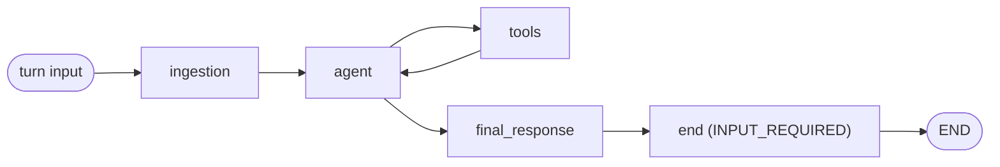

# Chat engine: the conversational boundary for chat-partial flows

Chat-partial flows run today on `chat.Workflow`, a separate executor with its own graph, state, and turn handling.
The chat engine replaces that executor with the Flow Registry's own. `Flow` and `FlowGraphBuilder` run the turn,
and a thin flow class, `ChatFlow`, owns the conversational boundary and nothing else.

This page is normative. It describes what the chat engine does and does not do once complete. It is revised by
merge request as decisions change.
Sequencing and rollout status live in
[ai-assist#2780](https://gitlab.com/gitlab-org/modelops/applied-ml/code-suggestions/ai-assist/-/work_items/2780).
The design record is
[ai-assist#2693](https://gitlab.com/gitlab-org/modelops/applied-ml/code-suggestions/ai-assist/-/work_items/2693).

[[_TOC_]]

## Model

The chat engine is a boundary policy over the shared executor, not a second engine.

- Every component is shared. `AgentComponent`, the tool nodes, approvals, compaction, and streaming are the same
  classes ambient flows use, unchanged.
- The graph is built by `FlowGraphBuilder` and run by `Flow`. `ChatFlow` subclasses `Flow` and overrides three seams.
- Nothing in the engine assumes a component count or a topology. Every mechanism on this page reads the declared
  graph and works on any shape. The chat-partial environment keeps its existing rule of one root `AgentComponent`.
  That rule belongs to the environment, not to the engine.

| Seam | `ChatFlow` decides |
|------|--------------------|
| `_graph_builder`: a builder subclass that seeds the terminal component and rejects graphs that cannot reach it | Where a turn ends |
| `_initial_entry_dispatch`: the structural dispatch strategy | Where a turn begins |
| Entry wiring: the builder seeds the ingestion node like the terminals, sets it as the entry point, and hops to the declared entry component | What crosses the line inbound |

Streaming is the shared mechanism end to end. The client's `startRequest.streaming` flag reaches `ChatFlow` through
`Flow` and decides whether the notifier forwards model chunks. `AgentComponent` streams tokens only when its
`ui_log_events` declare both `on_agent_final_answer` and `on_agent_reasoning`, because a chunk cannot be told apart as
one or the other while it is produced. The defaults in [Configuration](#configuration) declare both, so an engine-owned
config streams the way legacy chat does. A declared subset that drops either one turns token streaming off for that
component.

## Invariants

1. **A turn is one invocation.** Each user message enters through ingestion as graph input, runs to `END`, and the
   session is at rest between turns.
1. **The terminal component commits the boundary.** The seeded terminal writes `INPUT_REQUIRED` as the last state
   update of the turn. A turn that stops before the terminal runs leaves the tip mid-turn, and the next message
   rolls the session back to the last boundary (see [Recovery](#recovery)).
1. **Mid-turn pauses are interrupts.** Tool approvals pause the turn with `interrupt()` and never end it.
   Clarifying-input gates, when they arrive, are elicitation
   ([epic &55](https://gitlab.com/groups/gitlab-org/modelops/applied-ml/code-suggestions/-/work_items/55)) under the
   same rule.
1. **Documented grain only.** Plain input starts turns and `Command(resume=)` answers interrupts. Nothing else is
   graph input.

One live turn per thread is a client contract, not an engine invariant. Nothing fences concurrent entry today, and
clients disable send while a turn runs. Admission, fencing, and zombie termination are out of scope for the chat
engine and are tracked in
[ai-assist#2877](https://gitlab.com/gitlab-org/modelops/applied-ml/code-suggestions/ai-assist/-/work_items/2877).

## Where a turn ends

The builder seeds terminal components for every flow. Authors never declare them. `ChatFlow`'s builder seeds `end`
as a terminal that writes `INPUT_REQUIRED` instead of `COMPLETED`. `abort` is unchanged.

A turn ends when it reaches `end`. Declared routers, including conditional ones, attach exactly as they do in ambient,
and the builder adds none of its own. Every component reachable from the entry must be able to reach `end` through
those routes. The builder rejects a graph that breaks this when the session's graph is built, with an error that names
the components that cannot. That covers a graph with no route to `end`, a component with no outgoing router, and a
loop with no way out. A component consumed as a subagent is part of its supervisor and is not in the built graph.

The chat-partial environment rejects declared routers and completes the config instead: its one component is the
entry point and routes to `end`.

The status write is the terminal's own node update. No component's node is wrapped or altered.


```mermaid
flowchart LR
    input([turn input]) --> ingestion
    ingestion --> agent
    agent --> tools
    tools --> agent
    agent --> final_response
    final_response --> boundary["end (INPUT_REQUIRED)"]
    boundary --> fin([END])
```

## Where a turn begins

Entry dispatch classifies every client event from the checkpoint tip and its pending writes. The Rails status is a
projection of the tip, reconciled toward it, and is never the source of classification.

| Tip | Event | Mode | Mechanism |
|-----|-------|------|-----------|
| No checkpoints | message | START | New invocation, graph input through ingestion |
| Boundary: `END` reached, `INPUT_REQUIRED`, nothing pending | message | TURN | New invocation from the tip, through ingestion |
| Pending `__interrupt__` writes | approval or rejection | RESUME | `Command(resume=)` |
| Stopped mid-turn | message | TURN | From the last boundary, once `Flow`'s stop recovery rolls the session back. See [Recovery](#recovery) |
| Failed mid-turn | message | TURN or REJECT | TURN from the last boundary when the walk lands on one. When it lands on an answered gate, an error that asks the user to retry first. See [Recovery](#recovery) |
| Still running, per Rails | message | REJECT | An error that asks the user to retry first, so no message is dropped |
| Pending `__interrupt__` writes | message | RESUME | `Command(resume=)`: the message answers the wait, see [What crosses the line inbound](#what-crosses-the-line-inbound) |
| Mid-turn at rest | reconnect, no message | RETRY | Replay from the tip, unchanged. A client can offer it as `/retry` |
| Any checkpoint pinned by `resume_checkpoint_ts` | message | TURN | New invocation from the pinned checkpoint, through ingestion. LangGraph writes the fork checkpoint |
| Boundary, nothing pending | approval or rejection | REJECT | Stale event, structured error |

Dispatch is a strategy on the checkpointer. Every other flow keeps the default, `rails_status_dispatch`. `ChatFlow`
selects `structural_entry_dispatch`. TURN and RESUME project to the same wire event, so clients need no change.

## What crosses the line inbound

Every user message is shaped by the same pure stages, the first message and the fortieth alike. Each stage is a
function in `duo_workflow_service/entities/message_ingestion.py` and its sibling modules, and legacy `chat.Workflow`
consumes the same stages.

Stages 1 to 3 below read only the message, so `ChatFlow` runs them before the graph, once for every message. It claims
the attachments, tells a platform directive from a message, and renders the message. The result then crosses at one
of two sites.

**Plain input** (START and TURN) enters through the ingestion node. The builder seeds it like the terminals and sets
it as the entry point. The node owns only what needs the graph. For a directive it runs the system turn and hops to
`end`. For a message it refreshes the envelope inputs and normalizes history (stages 4 and 5), then hops to the
declared entry component. A message after a stop is plain input too, because the session has rolled back to the last
boundary first (see [Recovery](#recovery)).

**A message that answers a wait**, at a gate or a tool approval, is a resume value. A resume never runs the ingestion
node, because LangGraph hands it straight to the node that waits, so `ChatFlow` hands the rendered message to `Flow`'s
resume, which already refreshes the envelope inputs. The rendered content needs a new `FlowEvent` field, because
`message` is a plain string and cannot hold attachment content blocks. With it the waiting component gets the same
message an entry would. The waiting component writes the USER UI log entry itself. What the wait does with the
message stays the waiting component's.

The stages, in order:

1. Claim attachments out of `additional_context` (`category: attachments`) into content blocks. Attachments are
   message-scoped and never enter `context.inputs`.
1. Tell a platform directive from a message, from the raw text. `/compact` runs as a system turn: the ingestion node
   mutates state at a platform-owned node, writes the UI log entry, and reaches the boundary. The engine renders no
   command macros. Slash text that is not a directive reaches the model unchanged.
1. Render the user message once. The rendered text is the `HumanMessage` content. Raw content and context ride in
   `additional_kwargs`. After a rollback the rendered text of plain input starts with the `cancelled_turn` transcript
   (see [Recovery](#recovery)). A resume after a rollback only reaches a `HumanInputComponent`, because the walk stops
   only at `INPUT_REQUIRED`, and its fetch node already prepends the transcript, so a resume leaves it out and the
   model never reads it twice.
1. Refresh envelope inputs into `context.inputs`, which is flow-scoped, through `Flow._process_additional_context`, so
   schema and version validation run with the refresh. After a rollback the refresh carries the `cancelled_turn`
   envelope.
1. Normalize history: budget reset, the USER UI log entry, internal events.

Rendering commands are templated by the client. The IDE webviews template the four flagship commands before the
cutover. The directive invocation surface belongs to the commands track.

## Recovery

A message after a stop rolls the session back. `ChatFlow` keeps `Flow`'s stop recovery unchanged: the walk finds the
newest `INPUT_REQUIRED` checkpoint and pins the run there, discarding everything the stopped turn did. On the engine
that is the stopped turn's input checkpoint, which LangGraph writes before the turn's first node and which still holds
the last boundary's state, so the message enters from it as a TURN. A stop in the first turn has no boundary, and the
walk starts the session again from its first checkpoint with the new message. `chat` and ambient flows recover through
the same walk, so every v1 flow rolls back.

The discarded turn's user and agent messages reach the model as the `cancelled_turn` envelope, the transcript delta
`Flow` computes between the tip and the boundary. Tool entries are left out. Ingestion includes it by default: the
message starts with the transcript, and the envelope is cleared once read, so a later message never repeats it.
`HumanInputComponent` treats it the same way on a resume, and no flow has to declare anything. An entry component
that declares an input named `cancelled_turn` overrides the default, and a literal empty value turns it off.

No recovery undoes a tool call that ran before the stop. What rolling back adds is that the model never sees that
call, because `cancelled_turn` leaves tool entries out. What the envelope should carry is tracked with cancellation.

A message after a failure rolls back only to a turn boundary. `Flow` runs the walk only after a stop, so `ChatFlow`
runs it itself when Rails reports the session failed. When the walk lands on a boundary, the message enters from
there as a TURN. The boundary is `end`, the session's first checkpoint, or the failed turn's input checkpoint, which
still holds the last boundary's state, as after a stop. When the walk lands on a gate the user already answered,
rolling back would reopen the gate and read the message as its answer, so the message is rejected with an error
that asks the user to retry first. A retry is an entry with no message, which replays the failed step through `Flow`'s
retry. A client can offer it as `/retry`, and the engine adds no directive for it. Chat-partial has no gates, so a
failure there always rolls back. A message while Rails still reports the turn running is rejected the same way, so no
message is dropped silently. A stop rolls back to an answered gate as well, which is tracked with cancellation.

A client-requested fork is not recovery. Manual retry pins an earlier checkpoint through `resume_checkpoint_ts`, and
the message enters as a TURN from there. A TURN is plain graph input, so LangGraph treats the pinned checkpoint as
[time travel](https://docs.langchain.com/oss/python/langgraph/use-time-travel#fork) and writes the fork checkpoint
before the first node runs.

## Selection and rollout

Engine selection is a registry-level table of engine-owned config versions, keyed by `config_id` and `version`, and
consulted by `flow_factory`. A listed version builds `ChatFlow`. Every other chat-partial version builds
`chat.Workflow`. No shipped version is listed at launch, so existing configs are unchanged by construction. An owner
moves a flow to the engine by shipping a new config version and listing it.

`agentic_chat/2.0.0` is the first listed version. It is reachable by explicit pin:

```shell
duo --flow-config-id agentic_chat --flow-version 2.0.0 --flow-config-schema-version v1
```

The single flagged change is routing definition `chat` to `agentic_chat/2.0.0` under
`engine_owned_chat_environment` (GitLab Rails [!250286](https://gitlab.com/gitlab-org/gitlab/-/merge_requests/250286)).
It requires per-session pinning, described under [Sessions in flight](#sessions-in-flight), and the IDE webviews
templating the four flagship commands.

## Configuration

Authors write the v1 config they write today. The engine adds no fields and removes none. Defaults the chat surface
guarantees are `AgentComponent`'s own, keyed on the `chat-partial` environment and filled when the builder constructs
the component, so one layer owns them and a renamed field cannot leave a dead default behind. At load time,
`PartialFlowConfig.to_config()` fills in only what the builder requires and the environment lets authors omit:
`routers` and `flow.entry_point`.

| Field | When absent | When declared |
|-------|-------------|---------------|
| `ui_log_events` | `on_agent_final_answer`, `on_agent_reasoning`, `on_tool_execution_success`, `on_tool_execution_failed` | Declared values win. Legacy `chat.Workflow` ignores this field, so a declared subset restricts output on the engine, and a subset without both LLM output events turns token streaming off (see [Model](#model)). Owners see this change at their version swap. |
| `require_tool_approval` | `true` | Declared value |
| `pre_approved_tools` | Not applied | Not applied. Deprecated in [ai-assist#2744](https://gitlab.com/gitlab-org/modelops/applied-ml/code-suggestions/ai-assist/-/work_items/2744). |
| `compaction` | Engine defaults | Declared values |
| `max_cycles` | Engine default, reset at ingestion on every turn | Declared value, reset at ingestion on every turn |

File-based prompt references are a registry capability. A `prompts:` entry with `prompt_id` and a semver `version`
resolves the existing registry prompt with every model-family variant.

`agentic_chat/2.0.0`, abbreviated:

```yaml
version: "v1"
environment: chat-partial
name: "Agentic Chat"
description: "GitLab Duo Agentic Chat"
product_group: "agent_foundations"

components:
  - name: chat_agent
    type: AgentComponent
    prompt_id: chat_agent_prompt
    toolset:
      - get_project
      - gitlab_issue_search
      - read_file
      - create_merge_request
      # The full toolset is in the config file.

prompts:
  - name: chat_agent_prompt
    prompt_id: "chat/agent"
    version: "^1.0.0"
    unit_primitives: [duo_chat]
```

## Sessions in flight

A session created on `chat.Workflow` and resumed on the engine would classify as TURN and read its history under the
wrong key. Three layers prevent that, in order:

1. **Guard.** `ChatFlow` rejects a tip whose channels or node names are not the engine's, with a user-facing error to
   start a new chat. Ships with the engine.
1. **Pin.** Rails stores the resolved `config_id` and `version` at session creation and sends them on every resume. The
   gateway routes by the pin. In-flight legacy sessions finish on legacy. This is a precondition for the cutover, and
   the decision is owed by Rails.
1. **Converter.** Rewrite a legacy tip at a clean boundary into an engine boundary checkpoint. Built only if the
   legacy executor cannot be retired behind a read-only cutoff for old threads. The decision is owed by product.

## Out of scope

- Turn admission, fencing, and zombie termination.
- Other environments. Every mechanism on this page is graph-agnostic. Activating any of it for `chat` or `ambient`
  is a separate decision, and those environments are unchanged by this work.
- Client protocol changes.
- The alternatives UI over forked branches. Rails groups them by `parent_ts` today, and the engine changes nothing
  there.
- New config fields, including any `commands:` block or a flattened schema.

## Open items

- Directive invocation surface: slash text, client affordance, or protocol event. Owned by the commands track.
- Directives sent while something waits. Stage 2 ends a directive's turn at the boundary, which a waiting turn cannot
  reach without abandoning the wait.
- `gitlab-lsp`: template `/explain`, `/fix`, `/refactor` and `/tests` in both IDE webviews before the cutover.
- Pin at session creation and the read-only cutoff for old threads.
- Per-owner acceptance of the `ui_log_events` change at version swap.
- Cancellation, tracked in
  [ai-assist#2998](https://gitlab.com/gitlab-org/modelops/applied-ml/code-suggestions/ai-assist/-/work_items/2998): the
  effects of tool calls a rollback discards, what `cancelled_turn` tells the model about them, and a stop that rolls
  back to an answered gate. Approached for chat and chat-partial together.
- At-rest session status, distinct from `INPUT_REQUIRED` at the boundary:
  [ai-assist#2878](https://gitlab.com/gitlab-org/modelops/applied-ml/code-suggestions/ai-assist/-/work_items/2878).
  When it lands, the seeded terminal writes the new status and nothing else in the engine changes.
