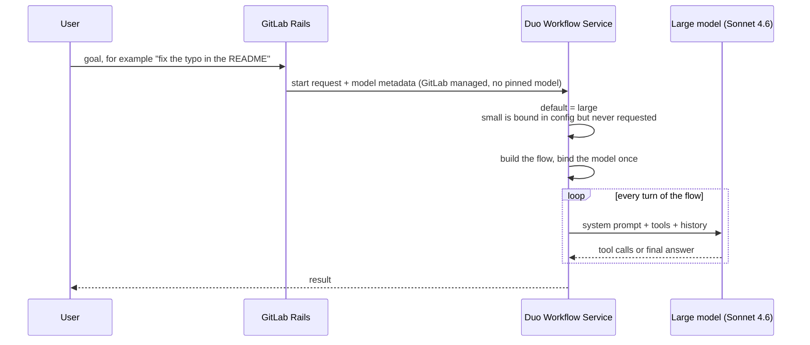
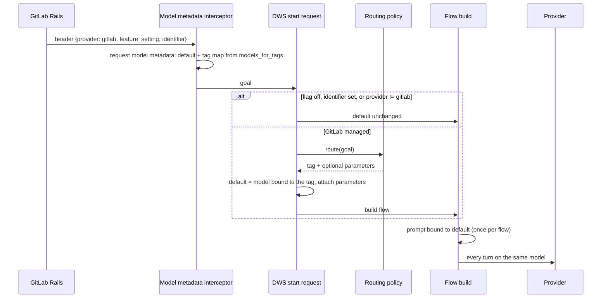
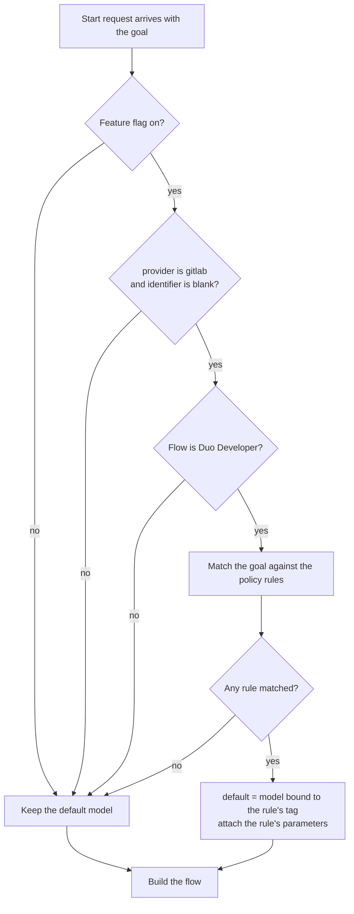
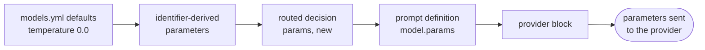
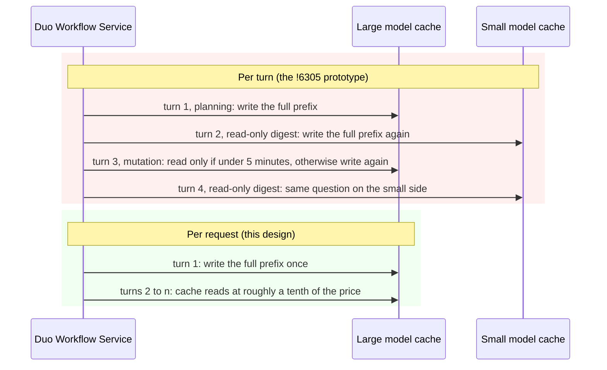
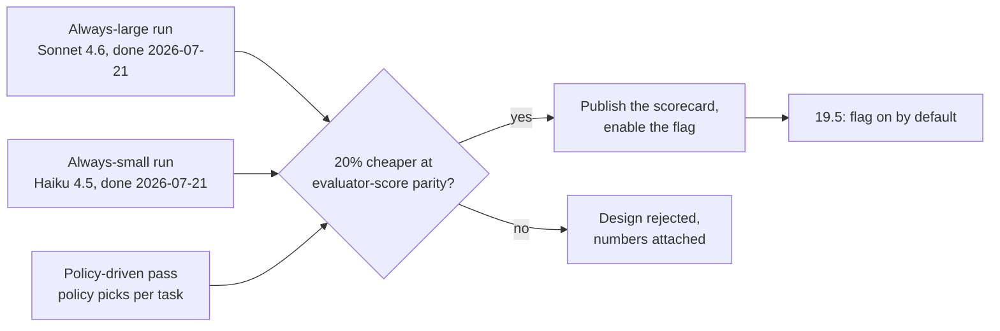

# Model routing: per-request small/large selection for Duo Developer

- Status: proposed
- Authors: `@nateweinshenker`
- DRIs: `@nateweinshenker` (engineering); implementation `@manojmj`; evaluation `@nlee8`; product `@julie_huang`
- Owning group: `group::ai core infra`
- Participating groups: Model Selection, Eval/CEF
- Creation date: 2026-09-03
- Tracking issue: [ai-assist#2707](https://gitlab.com/gitlab-org/modelops/applied-ml/code-suggestions/ai-assist/-/work_items/2707)

This document follows the
[Architecture Design Workflow](https://handbook.gitlab.com/handbook/engineering/architecture/workflow/).
Decisions live under [`decisions/`](decisions/).

## Summary

Every Duo Developer request runs on the large model, whatever the task. The gateway already knows
two models for the feature: `unit_primitives.yml` maps the `small` tag to Haiku 4.5 and the `large`
tag to Sonnet 4.6. Nothing picks between them.

This document proposes the smallest change that does: once per request, before the flow is built,
Duo Workflow Service (DWS) reads the user's goal, matches it against a reviewable list of keyword
rules, and sets the request's default model to the `small` or `large` tag. A rule can also set the
temperature for the chosen model. Explicit model choices are never overridden. The change ships
behind a feature flag, and is measured with the Central Evaluation Framework (CEF)
against always-small and always-large before the flag turns on. The proposal targets turning the
flag on by default in 19.5, contingent on clearing that evaluation gate.

Load balancing, failover, provider switching, learned classifiers, and a policy pipeline are out of
scope; see [Deferred](#deferred).

## Background

### The system being changed

GitLab Rails sends every agent platform request to DWS with a model metadata header. For a
GitLab-managed setting the payload is `{provider: gitlab, feature_setting: <name>, identifier:
<pinned model or blank>}`; for a self-hosted model it is
`{provider: openai, name, endpoint, api_key, identifier}`. A DWS interceptor turns that into the
request's model metadata: a `default` model plus a tag map built from the feature setting's
`models_for_tags`. Components ask for a model by tag and get the first matching tag or `default`.

The Duo Developer flow configs define one agent component and set no tags. Every call resolves to
`default`. The model is bound once, when the agent component builds its prompt at graph
construction, and stays bound for the life of the flow.



### Terms

| Term | Meaning |
|---|---|
| Feature setting | Per-feature model configuration Rails sends with each request. Duo Developer has a dedicated `duo_developer` setting in both `unit_primitives.yml` and Rails ([`gitlab!251961`](https://gitlab.com/gitlab-org/gitlab/-/merge_requests/251961)). |
| Model tag | A label (`small`, `large`) that `models_for_tags` binds to a concrete model per feature setting. |
| GitLab managed | The customer-facing setting meaning "GitLab picks the model". Requests carry a blank `identifier`. |
| Explicit selection | An admin or user pinned a model (`identifier` set), or the model is self-hosted. Never routed. |
| CEF | Central Evaluation Framework. Runs a feature's workload against a model and reports evaluator scores, tokens, and latency. |
| Prompt cache | Provider-side reuse of a request prefix (system prompt, tools, history). Anthropic and Gemini caches are scoped to one model. |
| vLLM-SR | [vLLM Semantic Router](https://vllm-sr.ai/docs/intro), an open source routing layer. Its signal catalogue and decision schema are kept as reference in [ADR-003](decisions/adr-003-keyword-signal-vllm-sr-schema.md)'s alternatives, not adopted wholesale. |

## Motivation

The problem is narrow: a Duo Developer request that fixes a typo pays Sonnet prices for every turn,
and a request that redesigns a module can only ever get the model the feature setting names.

Two constraints keep the scope tight. Fault tolerance, provider switching, and a policy pipeline
are separate problems, and none of them is needed to switch between the two models we already
have. And routing cannot work for self-hosted models, because only Rails knows what they are.

What is left is the simplest version: select the model once per request from the prompt,
keyword-based, behind a flag, evaluated before release. This document records that design and the
reasons for two choices that are easy to get wrong: deciding once per request rather than per turn,
and writing the matcher ourselves rather than adopting a router product.

### Goals

- Duo Developer requests that ride the GitLab-managed default get `small` or `large` chosen from the
  goal text, with an optional temperature per rule.
- The policy is data in this repository, reviewable in a merge request, and ships everywhere the
  gateway ships. No request depends on anything outside the pod.
- An explicit model choice, including every self-hosted model, is never overridden.
- The change is measured: a CEF run pinned to an exact gateway build before the flag turns on,
  with the scorecard published rather than the saving asserted.

## Proposal



One decision, made before the flow exists, applied through the object every component already
reads. No component, flow config, or prompt definition changes.

## Design

### Where the decision runs

The hook sits in the DWS start-request handler, after the goal is read and before the flow is
built. It runs only when the feature flag is on for the request (`duo_developer_model_routing`, defined
in Rails and pushed to the gateway like every other flag), the model metadata has
`provider: gitlab` with a blank `identifier`, and the flow is Duo Developer.



The hook reads the request's model metadata, picks a tag, sets `default` to the model bound to
that tag, attaches the decision's parameters, and writes the object back. Everything downstream
sees one consistent model for the whole flow. The prototype in
[!6305](https://gitlab.com/gitlab-org/modelops/applied-ml/code-suggestions/ai-assist/-/merge_requests/6305)
already has this shape, including the bypass checks and validation of every routing target against
the feature setting's `selectable_models`.

Self-hosted models arrive with `provider: openai` and an `identifier`, so they take the bypass
path by construction. The gateway never needs to know which models a customer runs, which answers
the review thread on self-hosted and air-gapped installs. Self-managed instances that use
GitLab-managed models get the same routing as GitLab.com.

### The signal and the policy

The v1 signal is a keyword match on the goal text. It needs no model call and no network call,
costs a regex pass, works identically on every install, and is the kind of rule a reviewer can read
in a diff. It is also the signal already evaluated offline in
[!6289](https://gitlab.com/gitlab-org/modelops/applied-ml/code-suggestions/ai-assist/-/merge_requests/6289),
whose offline evaluator handles exactly this rule shape.

The policy lives in `unit_primitives.yml`, the file already reviewed for every model change,
rather than a new routing-specific file. `models_for_tags` gains two fields per tag: `models`, a
list, so a tag can still resolve to more than one provider variant of the same model, the same way
`default_models` already does, and `keywords`, the deterministic signal. Tags are checked in a
fixed order, `large` before `small`, so a goal matching both escalates to `large`. No tag matching
keeps today's behavior, `default_models`.

```yaml
# ai_gateway/model_selection/unit_primitives.yml (proposed extension)
models_for_tags:
  large:
    models: [claude_sonnet_4_6, claude_sonnet_4_6_vertex]
    keywords: [refactor, migration, race condition, concurrency, architecture, security]
  small:
    models: [claude_haiku_4_5_20251001, claude_haiku_4_5_20251001_vertex]
    keywords: [typo, readme, documentation, docstring, comment, bump, rename, unused, deprecate]
    params:
      temperature: 0.0 # placeholder, the evaluation grid sets the shipped value
```

The keyword lists above are the starter policy from
[!6289](https://gitlab.com/gitlab-org/modelops/applied-ml/code-suggestions/ai-assist/-/merge_requests/6289),
not the shipped one. The evaluation decides what ships. Keyword signals are the fastest path to a useful decision and the cheapest to
review, but they are sensitive to wording and can be triggered intentionally, so they are routing
hints, never a security boundary. A new signal type later, a context-length band, a structure
count, a metadata hint passed by Rails, adds a new key next to `keywords` on the tag entry it
applies to; entries that don't use it, and the file's shape, don't change. [ADR-003](decisions/adr-003-keyword-signal-vllm-sr-schema.md)
covers why the policy sits in `unit_primitives.yml` instead of a standalone schema, and what that
rules out.

### Inference parameters

A decision can set the temperature of the model it picks. Today temperature comes from
`models.yml`, where both tier models declare `temperature: 0.0`. The prompt builder merges
parameters with a fixed precedence, and the Duo Developer prompt definition sets none of its own,
so the `models.yml` value applies. The only override that exists is deployment-wide and applied at
startup. Nothing is per request.

The change adds one layer: the router attaches the decision's `params` to the resolved model
metadata as a request-scoped override, and the prompt builder merges it between the prompt
definition and the identifier-derived parameters. A routed temperature therefore beats the
`models.yml` default and loses to a prompt author's explicit choice.



Each box overrides the ones to its left.

Validation happens when the policy loads, not per request:

- `params` must validate against the target model's parameter schema.
- Sampling parameters are provider- and model-specific. The Claude 4.x line (Sonnet 4.6, Haiku
  4.5) accepts `temperature`; Sonnet 5 rejects non-default values; Opus 4.7 and later and Fable 5
  return a 400 for any sampling parameter. Gemini 3 models omit temperature by default (Google
  applies 1.0) and accept 0 to 2. A policy that sets `temperature` for a model that rejects it
  fails to load, and the gateway starts with routing disabled rather than failing requests.

Temperature is not among the parameters that invalidate a provider prompt cache. `thinking`,
`effort`, and Gemini's `thinking_level` are: a change invalidates the messages cache on Anthropic
and the knobs differ per provider. They stay out of v1.

### Telemetry

Every routed request emits one structured log line and one internal event: matched keywords, tag,
resolved model, parameters applied, and flag state. The billing event
already records the model that served the call; credits are keyed to model identity, so that
record is what reconciles cost against the routing decision.

## Why once per request and not per turn

The [!6305](https://gitlab.com/gitlab-org/modelops/applied-ml/code-suggestions/ai-assist/-/merge_requests/6305)
prototype switched models per turn: turns that only digested read-only tool results ran
on the small model. Four facts argue against that for v1.

1. Prompt caches are scoped to one model. Anthropic's guidance is direct: a model switch has no
   escape hatch, and it invalidates the tools, system, and messages caches together. Gemini's
   implicit cache is also model-bound. Every switch re-writes the whole prefix on the new model at
   1.25 times the input price, while the other model's entry expires after five minutes of no
   reads. Duo Developer turns are input-heavy with a long shared prefix, so per-turn switching
   trades cache reads at roughly a tenth of the price for repeated full writes.
1. Minimum cacheable prefixes differ. Haiku 4.5 needs 4,096 tokens before anything caches; Sonnet
   4.6 needs 1,024. A short flow that caches on Sonnet may not cache on Haiku at all.
1. The model is bound once per flow. The agent component builds its prompt with the resolved model
   at graph construction. Per-turn switching needs a prompt object per tier and a per-turn
   selector, which is the machinery
   [!6305](https://gitlab.com/gitlab-org/modelops/applied-ml/code-suggestions/ai-assist/-/merge_requests/6305)
   had to add.
1. The upside was bounded and the cost was not. The prototype downgraded only on turns following
   all-read-only tool calls; every planning, mutation, and answer turn stayed on the large model.



Even vLLM-SR, whose whole purpose is routing, treats a mid-session switch as a cost to weigh: its
[learning layer](https://vllm-sr.ai/docs/tutorials/learning/overview) scores a proposed switch
against "prefix-cache evidence, handoff cost, switch history" before applying it.

One per-request decision keeps the cache warm for the whole flow and needs no component changes.
The one per-turn variant worth revisiting later is a one-way escalation from `small` to `large` at
a step boundary, at most once per flow: it costs a single cache rebuild and never downgrades. It is
deferred until the per-request version has evidence behind it. This answers the "cache-boundary
routing" question left open in
[`gitlab-org/gitlab#603416`](https://gitlab.com/gitlab-org/gitlab/-/work_items/603416).

## Why in-house and not a router product

Four candidates were scored. The facts that settle it:

- **vLLM Semantic Router.** Envoy carries traffic and calls the Router over the External
  Processing protocol; the docs state that "Semantic Router and its inference backends are
  separate services". It deploys as Docker (`vllm-sr serve` starts the Router, Envoy, and a
  dashboard), Kubernetes Helm or Operator, or a gateway integration. The `vllm-sr` package on
  PyPI (0.3.0) is a CLI that orchestrates those containers; it exposes no importable Python API
  for evaluating signals or decisions. Adopting it means every self-managed customer runs a second
  service on the request path. Its learned signals need an embedding runtime and, per its docs,
  candidate phrases and thresholds "must be calibrated together against labeled traffic". The
  part we need, keyword decision evaluation, is about 110 lines of Python with tests in
  [!6289](https://gitlab.com/gitlab-org/modelops/applied-ml/code-suggestions/ai-assist/-/merge_requests/6289).
  We don't keep vLLM-SR's schema; [ADR-003](decisions/adr-003-keyword-signal-vllm-sr-schema.md)
  covers why the policy lives in `unit_primitives.yml` instead, with the schema kept only as
  reference. If the evidence ever calls for learned signals, the keyword lists and model bindings
  port to whatever adopts them next.
- **LiteLLM Router.** It solves endpoint balancing, retries, and cooldowns, all out of scope here,
  and it is not used anywhere in this codebase today.
- **AI21 hosted proxy.** Hosted, so it cannot serve self-managed installs.

Recorded as [ADR-001](decisions/adr-001-in-process-routing-layer.md).

## Measurement and the decision gate

Baselines exist. [ai-assist#2599](https://gitlab.com/gitlab-org/modelops/applied-ml/code-suggestions/ai-assist/-/issues/2599)
ran Haiku 4.5 and Sonnet 4.6 on the Duo Developer SWE-Bench Pro set
(`swe.validation_stratified_b06f4db4_p30.all.next`, evaluators `mr_created` and
`issue_to_mr_resolved`) on 2026-07-21. The evaluation for this design adds:

- A policy-driven pass over the same SWE-Bench Pro set, with each task's model chosen by the
  policy. The eval output records the model each task ran on.
- Cache-adjusted cost: cache read and write tokens are already instrumented in the gateway's model
  request metrics, so cost is measured, not estimated.



The gate is unchanged from #2599: a routed policy ships only if it cuts token cost by 20% or more
at evaluator-score parity with always-large on the holdout. Every run is pinned to an exact build,
`gl_commit`, `aigw_commit`, and `cef_docker_tag`, per the CEF
[advanced usage guide](https://gitlab.com/gitlab-org/modelops/ai-model-validation-and-research/ai-evaluation/prompt-library/-/blob/main/doc/server/advanced_usage.md).
Each policy change therefore has a reproducible before and after, rather than one pass-or-fail
verdict at the end. Scores are published to the
[model evaluation leaderboard](https://gitlab.com/gitlab-org/modelops/ai-model-validation-and-research/ai-evaluation/analytics/-/blob/main/doc/model_evaluation_results.md)
alongside the rest of our model reporting.

## Iteration

1. **Evaluate.** Add the policy-driven pass to the existing CEF runs. Model
   candidates for each tier come from the Model Selection group.
1. **Implement behind the flag.** The start-request hook, the policy loader with validation, the
   request-scoped parameter override in the prompt builder, and the telemetry event. Flag off is
   exactly today's behavior; no router code runs.
1. **Log the decision before applying it.** The hook computes and logs a routing decision while
   the served model stays the same. That lets us compare live decisions against what the eval
   predicted before any request changes model.
1. **19.5 decision.** Clear the gate and the flag turns on by default; miss it and this document
   moves to rejected with the numbers attached.
1. **Expand.** Apply the same policy mechanism to other agentic features (Phase 3 in #603416).

## Deferred

These are out of scope for this design. They are deferred, not rejected:

- Cost-aware load balancing across provider endpoints and typed failover.
- A policy pipeline that regenerates the small/large mapping from CEF evidence and the cost sheet.
- A control-plane store and hot-reload distribution of policy.
- Endpoint capacity descriptors replacing hand-edited quota limits.
- Allowlist enforcement in the gateway (Phase 4 in
  [`gitlab-org/gitlab#603416`](https://gitlab.com/gitlab-org/gitlab/-/work_items/603416#note_3658992409)).
- Routing self-hosted models.
- Learned or embedding-based classifiers (vLLM-SR `complexity`, `embedding`, `domain`), including
  any classifier that needs a model call, and one-way mid-flow escalation.
- Per-decision `thinking`, `effort`, or `thinking_level`.
- Multi-lingual keyword policies. v1 ships English-only keyword lists; the matcher itself is
  language-neutral, so expanding coverage later is a policy-content change.
- Credits or billing changes.

## Decisions

- [ADR-001: Small/large routing is in-house code at the `models_for_tags` seam](decisions/adr-001-in-process-routing-layer.md)
- [ADR-002: The routing decision is made once per request; explicit selection bypasses it](decisions/adr-002-composition-precedence.md)
- [ADR-003: The v1 signal is deterministic keyword rules on `models_for_tags`](decisions/adr-003-keyword-signal-vllm-sr-schema.md)
- [ADR-004: A routing decision carries inference parameters, temperature in v1](decisions/adr-004-decision-carries-inference-params.md)

## Open questions

- Which concrete models fill `small` and `large` for Duo Developer at 19.5, and which
  temperatures the evaluation selects.
- Whether requests from catalog-defined flows that arrive without a `feature_setting` should
  resolve tags against `duo_agent_platform`, as the
  [!6305](https://gitlab.com/gitlab-org/modelops/applied-ml/code-suggestions/ai-assist/-/merge_requests/6305)
  prototype does.

## Further reading

- Tracking issue: [ai-assist#2707](https://gitlab.com/gitlab-org/modelops/applied-ml/code-suggestions/ai-assist/-/work_items/2707)
- Feasibility and decision gate: [ai-assist#2599](https://gitlab.com/gitlab-org/modelops/applied-ml/code-suggestions/ai-assist/-/issues/2599)
- Offline evaluation harness: [ai-assist!6289](https://gitlab.com/gitlab-org/modelops/applied-ml/code-suggestions/ai-assist/-/merge_requests/6289)
- Live routing prototype: [ai-assist!6305](https://gitlab.com/gitlab-org/modelops/applied-ml/code-suggestions/ai-assist/-/merge_requests/6305)
- Phased plan and allowlist de-scope: [`gitlab-org/gitlab#603416`](https://gitlab.com/gitlab-org/gitlab/-/work_items/603416)
- vLLM Semantic Router: [signals](https://vllm-sr.ai/docs/tutorials/signal/overview) and [decisions](https://vllm-sr.ai/docs/tutorials/decision/overview)
- Anthropic prompt caching: [documentation](https://docs.anthropic.com/en/docs/build-with-claude/prompt-caching)
- Model selection reference: [`docs/model_selection.md`](../model_selection.md)
