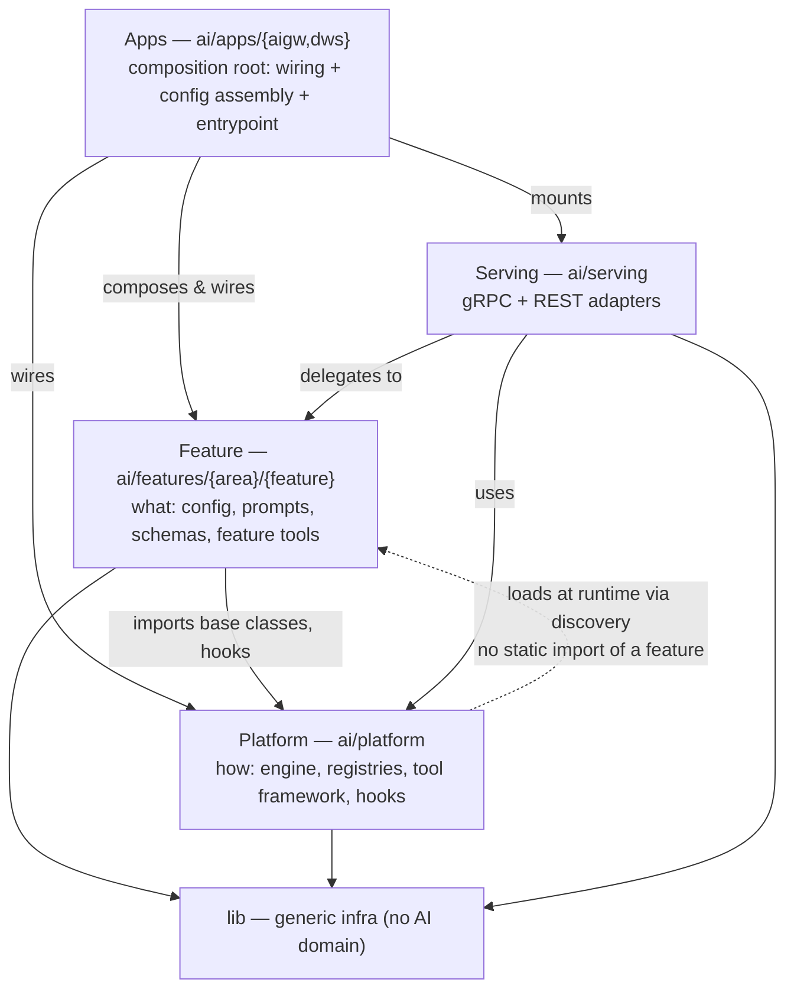

# Module boundaries

> Modules are being implemented. Follow [work item 43](https://gitlab.com/groups/gitlab-org/modelops/applied-ml/code-suggestions/-/work_items/43)
> for status.

Application code is organized by **capability**, not by deployment artifact or
technical layer. Each feature owns its full definition (config, prompts, schemas,
and feature-specific tools) in one place. Ownership is expressed in CODEOWNERS,
independent of the directory names: directories are named after *capabilities*
(which are stable), and CODEOWNERS maps *teams* to capabilities (which change as
teams are renamed or merged). This keeps the structural and the organizational
concerns independent.

## Structure

Everything application-facing roots under `ai/`. Features are grouped by capability
area under `ai/features/`; the platform, serving edge, shared definitions, and the
per-deployable composition roots (`ai/apps/`) sit alongside them under `ai/`. A
single CODEOWNERS describes ownership across them.

```plaintext
ai/
  features/                   # feature consumers: each owns its full definition
    pipeline/                 #   capability area (stable name, NOT a team name)
      fix_pipeline/           #     feature (flow)
      fix_pipeline_next/      #     feature (flow)
      pipeline_summary/       #     feature (prompt-only)
    code/
      code_completion/        #     feature (prompt-only): classic suggestions
      developer/              #     feature (flow)
      code_review/            #     feature (flow)
    chat/
      agentic_chat/           #     feature (flow)
      duo_chat/               #     feature (prompt)

  platform/                   # the "HOW": the engine that runs features (framework only)
    flow_engine/              #   runtime / state / executor
    prompts/                  #   registry, caching, base classes; NO definitions
    response_schemas/         #   registry only
    tools/                    #   tool framework + base classes (NOT feature tools)
    hooks/                    #   declared extension points features plug into

  serving/                    # transport: gRPC + REST adapters for every feature
    grpc/
    rest/

  apps/                       # composition roots: one per deployable
    aigw/                     #   AI Gateway: small container + REST edge + its config slice
    dws/                      #   Duo Workflow Service: small container + gRPC edge + its config slice
                              #   the ONLY place allowed to statically import features

  shared/                     # genuinely cross-feature definitions (kept minimal)

lib/                          # generic infra: billing, usage_quota, context, events
                              # (no AI-domain knowledge; lowest layer)
.gitlab/CODEOWNERS            # maps teams to capabilities; the single source of ownership
```

A "flow" is a feature shape, not a top-level category. Flows and simple prompts
are the same feature template with a different amount of machinery, so a
capability area that has both keeps them together. There is no `flows/` vs
`suggestions/` split, which would scatter one capability across two trees.

## Feature modules

Every feature uses one template; a prompt-only feature is the case with fewer
asset types:

```plaintext
ai/features/<area>/<feature>/
  config/       # FLOW ONLY: declares the graph the engine runs
  prompts/      # always
  schemas/      # if it has structured output
  components/   # FLOW ONLY: feature-specific tools (and a feature-specific
                #   node/agent in the rare case a feature needs one)
  tests/        # co-located; reuses global fixtures (see "Tests")
```

The presence of `config/` and `components/` is what makes a feature a flow. The
engine in `platform/flow_engine/` interprets `config/`; a prompt-only feature
calls the prompt registry directly.

Feature-specific tools live in the feature, under `components/`. The platform
owns the *tool framework* (base classes, registration, the calling convention) in
`platform/tools/`; a feature implements the tools only it needs. Generic tools
used across features live in the platform or shared layer. Nodes and agents are
generic by design and provided by `platform/flow_engine/`; `components/` holds a
feature-specific node or agent only in the rare case a feature genuinely needs
one.

## Dependency direction

The platform declares **how**; a feature implements **what**. Dependencies flow
in one direction, and the platform never statically imports a feature.



- A feature imports platform abstractions (base classes, the tool framework, hook
  interfaces).
- The platform does not import any feature. It discovers and loads feature
  implementations at runtime by scanning declared locations (see "Discovery").
  This is what lets a feature be added, moved, or removed without touching
  platform code.
- A feature customizes platform behavior only through declared extension points
  (`platform/hooks/`), never by leaking feature-specific code into the platform.
- The **composition root** (`ai/apps/`) is the single exemption: it sits at the top
  of the graph and its whole job is to assemble a deployable, so it is the one place
  allowed to statically import features and serving adapters. Nothing imports
  `apps/`. The guardrail lint permits feature imports under `apps/` and nowhere else.
- `lib/` imports nothing above it: no platform, no features.

This shape follows the same pattern as a thin platform that declares the contract
and features that supply the implementation. The rule is what keeps
the codebase coherent under agentic load, and a guardrail lint enforces it rather
than code review.

## Discovery

The platform locates definitions by identifier, scanning a set of roots: the
shared layer (`ai/shared/`) and each feature's `prompts/`, `schemas/`, `config/`,
and `components/`.

- The **prompt registry** resolves `<prompt_id>` across these roots; lookups are
  lazy and on demand.
- The **response-schema registry** resolves `<schema_id>` the same way, asserting
  path containment per root.
- The **flow config loader** discovers configs across feature directories and
  resolves a flow by identifier. Cross-flow references are resolved through the
  registry by identifier, not by relative path between feature directories.
- The **tool registry** discovers feature-specific tools under each feature's
  `components/`, alongside generic platform tools.

A guardrail lint (`lints/`) asserts the import graph: no definitions under
`platform/`, the platform does not import features, and `lib/` has no upward
imports.

## Serving

`serving/` holds only transport adapters, for both gRPC and REST. Each adapter
validates and translates the request and delegates into a feature (or the
engine), so the same feature is reachable over either protocol with no logic
duplicated in the controller. Business logic lives in the feature, not the
controller; serving is a thin edge.

## Composition and dependency injection

There is no single application container shared across deployables. Each deployable
has its own composition root under `ai/apps/` (`aigw`, `dws`), and each owns a
**small `ContainerApplication`** that wires together only what that deployable runs:
the platform container, the feature containers it serves, and its own configuration
slice. Dependency injection is scoped to the deployable — each app wires only the
packages it composes, so a dependency resolves within that app and a feature a
deployable does not serve is simply absent from its container rather than wired
across a boundary it should not cross.

Ownership of providers follows the same feature-first rule as everything else:

- A **feature owns the providers it needs** (its own container). The **platform owns
  the platform container**. An app only *composes* them; it declares no feature
  internals of its own.
- **Configuration is owned, not shared.** There is no config object spanning both
  deployables. The platform `Config` holds only genuinely platform-level settings
  (logging, auth, TLS, GCP, model limits, model selection). Each feature owns its own
  settings alongside its config. An app assembles the platform config plus the config
  of the features it serves — so one deployable never holds another's settings or
  secrets.
- **Which features a deployable serves is a feature-level declaration** (a feature
  declares its serving surface — transport and deployable), not a list maintained
  inside `apps/`. Adding or moving a feature edits the feature, never the composition
  root, so `apps/` stays thin and stable and does not become a new collision point.
- The composition root holds **wiring, config assembly, and the process entrypoint
  only** — no business logic — so it does not drift into the god object the per-app
  split exists to retire.

This is the end-state shape; how the present shared `ContainerApplication` and
`config.py` get carved into it is a migration concern, not a structural one.

## Ownership and CODEOWNERS

`.gitlab/CODEOWNERS` is the single source of ownership, and the only place that
names teams. Because directories are named after capabilities, a team rename or
merge changes CODEOWNERS lines, never the tree. Ownership maps onto the module
boundaries one-to-one:

- **Each feature** (`ai/features/<area>/<feature>/`) has its own CODEOWNERS entry,
  owned by the team that owns the capability. A feature owns everything under it:
  config, prompts, schemas, components, tests, and its own unit primitive
  definitions.
- **`ai/platform/`** is one scoped section owned by the platform team, because
  changes to the engine, registries, tool framework, and hooks need platform
  knowledge rather than feature knowledge. This is the section that previously had
  no dedicated owners and was absorbed into the catch-all.
- **`ai/serving/`** is owned by the team that owns the transport edge. That
  ownership extends to the deployment surface that exposes it: `.runway/`
  configuration and the container image packaging that publishes the gRPC and REST
  services carry the same operational knowledge, so they sit with the serving
  owners rather than in a separate generic pool.
- **`ai/apps/`** is owned by the team that owns the deployment surface, the same
  operational knowledge as `ai/serving/` and `.runway/`: composing each deployable,
  its wiring, and its config assembly. Because features self-declare their serving
  surface, routine feature work does not touch `apps/`.
- **`ai/shared/`** is owned by the platform team as a curated, minimal set, so
  adding to it is a deliberate, reviewed action rather than a default.

This replaces today's `*` catch-all, which routes every change at two large
maintainer pools, and gives a smaller, more focused review pool per domain. Two
consequences need planning rather than discovery later:

- Some domains will not have a user at the `maintainer` level on the project, so
  per-feature ownership needs supporting tooling, for example reviewer suggestion
  or granting maintainership across a feature group. This is being explored in
  [work item 2377](https://gitlab.com/gitlab-org/modelops/applied-ml/code-suggestions/ai-assist/-/work_items/2377).
- Automated reviewer assignment, for example the `@duo-developer-mr-review` bot,
  must spread load across each scoped pool. Otherwise splitting ownership into many
  small pools can re-concentrate reviews onto the same people the split is meant to
  relieve. Smaller pools are only a win if assignment respects them.

New GitLab groups can back these scopes, so the same mapping also feeds reviewer
roulette and other automation with accurate per-capability owners.

## Shared definitions

`ai/shared/` holds prompts and schemas used by multiple features (for example
`commit_changes` and `create_repository_branch`, referenced by several flows). It
is kept minimal: every definition that can belong to a single feature lives with
that feature. The platform registries always include `ai/shared/` as a scan root.

## Model selection

`model_selection` is split by meaning: selection **policy** (`*.yml`) is a
business concern owned by Fulfillment, and the selection **engine** (`*.py`) is
mechanism owned by platform. The boundary is policy versus mechanism; it happens
to fall on `.yml` vs `.py`.

Unit primitive configuration follows the same feature-first split. Rather than one
global `unit_primitives.yml`, each feature domain owns its own unit primitive
definitions alongside its other config, so the team that owns a capability also
owns the primitives that capability exposes. The current global file was modeled
on Duo Chat rather than the agentic platform, so the abstraction itself is a
candidate to revisit as part of the split rather than a structure to preserve.

## Tests

Tests are co-located in each feature's `tests/`. Global `conftest.py` fixtures are
shared across the codebase, and feature tests reuse those fixtures rather than
duplicating them (`--import-mode=importlib` supports co-located tests, and test
collection includes the feature directories).

## Relationship to the Component Ownership Model

This mirrors Infrastructure's
[Component Ownership Model](https://handbook.gitlab.com/handbook/engineering/infrastructure-platforms/production/component-ownership-model/)
(COM), applied to application code instead of IaC:

- **Platform, not permission.** The platform team owns the engine; each team owns
  its features, without platform maintainers on the critical path for routine
  feature changes.
- **A feature is a "component":** self-contained, versioned (`1.0.0.yml`),
  accessed through a defined interface (its config). The feature template is the
  paved path; the guardrail lint is policy-as-code.
- **Shared capability as an owned product.** `platform/` and the shared layer are
  owned by one team, consumed by every feature through a stable interface, with
  consumers treated as customers (the same pattern as COM's Tenant Observability
  Stack).

Unlike COM, components are **not** split into separate repositories. COM separates
repos to gain independent deployment lifecycles and self-managed portability;
neither applies here, because AI Gateway and DWS ship in the same Docker image and
features co-deploy with the engine. The need is *ownership* decoupling, not
*deployment* decoupling, so directories plus CODEOWNERS are the right-sized
mechanism: no repo sprawl, no version-bump dance to land a cross-cutting change,
atomic refactors across engine and features, and one CI/release pipeline. The
trade-off is that a monorepo has no *physical* limit to drift the way separate
repos plus semantic versioning do, so the guardrail lint is load-bearing: it
enforces by policy what COM gets for free from repo separation.

## Example: fix_pipeline

`fix_pipeline` is a flow under the `pipeline` capability area, owning its config,
prompts, schemas, and tests in one place:

```plaintext
ai/features/pipeline/fix_pipeline/
  config/
    1.0.0.yml
  prompts/
    context/
    create_plan/
    decide_approach/
    decide_comment/
    execution/
    add_comment/
    comment_link/
    push_changes/
    summarize_changes/
  schemas/
    decide_approach/
    decide_comment/
  components/        # feature-specific tools/nodes, if any
  tests/
```

- Prompt and schema identifiers keep a feature prefix (`fix_pipeline_create_plan`)
  because the registry namespace is flat: the directory provides organization, the
  identifier provides uniqueness.
- Shared prompts it uses (`commit_changes`, `create_repository_branch`) live in
  `ai/shared/`, since several flows reference them.
- `fix_pipeline_next` is a separate feature with its own directory and CODEOWNERS
  entry.
