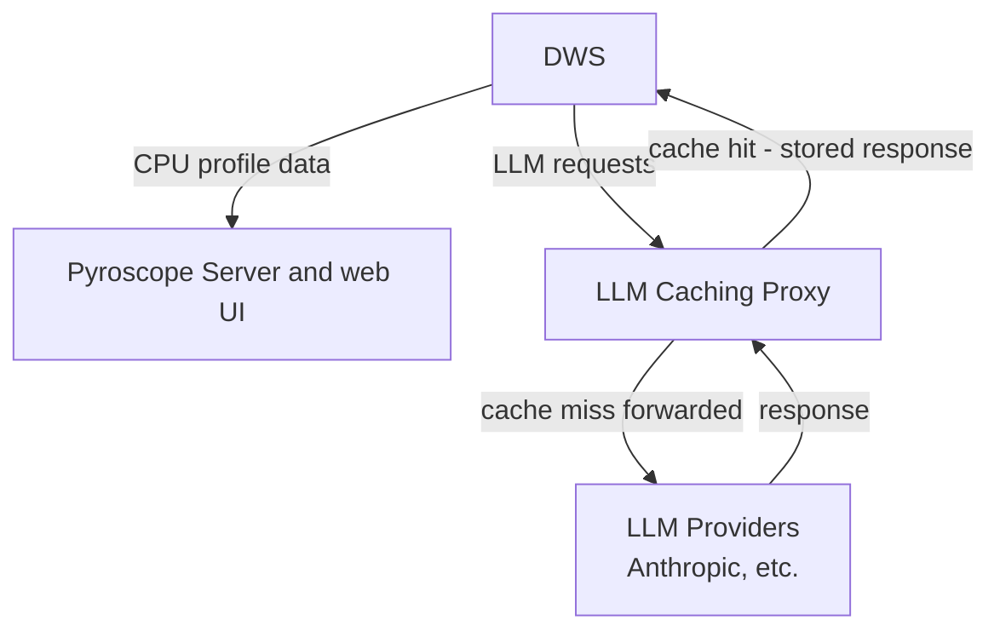

# Profiling DWS with Pyroscope and LLM caching proxy

Pyroscope is the recommended tool for profiling the Duo Workflow Service (DWS) in Cloud Run during load testing. It supports continuous profiling with profile data sent to a pyroscope server.

The [LLM caching proxy](https://gitlab.com/gitlab-org/ai-powered/ai-framework/llm-caching-proxy) is a lightweight transparent HTTP proxy that reduces API costs during load testing by caching LLM responses and works alongside Pyroscope for cost-effective profiling under load.

## Architecture



1. **DWS** - Duo Workflow Service with Pyroscope
1. **Pyroscope Server** - Receives profiles via HTTP and provides a web UI for viewing them
1. **LLM caching proxy** - Caches LLM responses to reduce API costs during testing

## Quick start: local testing

This assumes you have a local GitLab instance configured to use a local DWS instance.
For example, [GDK](https://gitlab.com/gitlab-org/gitlab-development-kit/-/tree/main/doc/howto/ai?ref_type=heads)
(if you do use GDK, stop the DWS instance in GDK before following the steps below).

1. Run the Pyroscope server locally in Docker:

   ```shell
   # Terminal 1
   docker run -p 4040:4040 grafana/pyroscope:latest
   ```

1. Start the [llm-caching-proxy](https://gitlab.com/gitlab-org/ai-powered/ai-framework/llm-caching-proxy) (listens on `http://localhost:8888`):

   ```shell
   # Terminal 2
   git clone https://gitlab.com/gitlab-org/ai-powered/ai-framework/llm-caching-proxy.git
   cd llm-caching-proxy
   poetry install
   ./scripts/manage_proxy.sh start
   ```

1. Run DWS with Pyroscope and the caching proxy enabled:

   ```shell
   # Terminal 3
   PYROSCOPE_ENABLED=true \
   PYROSCOPE_SERVER_URL=http://localhost:4040 \
   DUO_WORKFLOW_USE_CACHING_PROXY=true \
   poetry run duo-workflow-service
   ```

1. Send test requests. For example, via Chat in the GitLab web UI.
1. Open <http://localhost:4040> in your browser to see the Pyroscope UI with profiling data.

## Deploy to Cloud Run

This assumes you have a test GitLab instance you can configure to use the DWS instance you will deploy.
You can use a test instance based on the [3k Reference Architecture](https://docs.gitlab.com/administration/reference_architectures/3k_users/)
that was used in previous load testing efforts. See [these instructions to deploy and configure it](https://gitlab.com/gitlab-org/quality/gitlab-environment-toolkit-configs/performance-test-rfh/-/blob/main/configs/load-test-agentic-chat/README.md).

You can also use a [Sandbox Cloud environment](https://handbook.gitlab.com/handbook/company/infrastructure-standards/realms/sandbox/)
to deploy and configure a GitLab test instance.

**Note**: These scripts deploy each service open to the public and unauthenticated. They should not be left active while not in use, and should be destroyed as soon as testing is complete.

1. Deploy Pyroscope server:

   ```shell
   ./scripts/dws_load_test/deploy_pyroscope_server.sh
   ```

   This will:
   1. Deploy Pyroscope server to Cloud Run
   1. Output the Pyroscope server URL

1. Deploy the [llm-caching-proxy](https://gitlab.com/gitlab-org/ai-powered/ai-framework/llm-caching-proxy):

   ```shell
   git clone https://gitlab.com/gitlab-org/ai-powered/ai-framework/llm-caching-proxy.git
   cd llm-caching-proxy
   ./scripts/deploy_to_cloudrun.sh
   cd ..
   ```

   This will:
   1. Deploy the LLM caching proxy to Cloud Run
   1. Output the service URL. Save it, you'll need it for the next step.

1. Add the Pyroscope server URL and caching proxy URL to your `.env` file:

   ```plaintext
   PYROSCOPE_SERVER_URL=https://pyroscope-server-xxxxx-uc.a.run.app
   DUO_WORKFLOW_CACHING_PROXY_URL=https://llm-cache-proxy-XXXXXXXX-uc.a.run.app
   DUO_WORKFLOW_USE_CACHING_PROXY=true
   ```

1. Deploy DWS with Pyroscope:

   ```shell
   ./scripts/dws_load_test/deploy_with_pyroscope_to_cloudrun.sh
   ```

   This will:
   1. Pull the latest AIGW/DWS image and push it to GCP Artifact Registry
   1. Deploy to Cloud Run with `PYROSCOPE_ENABLED=true`
   1. Output the service URL and Pyroscope UI URL

1. Configure your test GitLab instance to use the new DWS deployment. Add the following to `gitlab.yml`:

   ```yaml
     production: &base
     duo_workflow:
        service_url: "<insert service URL from previous step>:443"
        secure: true
   ```

   Then `sudo gitlab-ctl restart`

1. [Run load tests](../../performance_tests/stress_tests/README.md).
1. View profiles in your browser using the Pyroscope UI (URL from Step 1):

   ```shell
   PYROSCOPE_URL=$(gcloud run services describe pyroscope-server \
     --region us-central1 \
     --format 'value(status.url)')

   echo "Open $PYROSCOPE_URL in your browser"
   ```

## Managing Cloud Run services

`scripts/dws_load_test/manage_cloudrun_services.sh` manages all three Cloud Run services (`dws-loadtest`, `llm-cache-proxy`, `pyroscope-server`) as a group.

```plaintext
Usage: ./scripts/dws_load_test/manage_cloudrun_services.sh <command> [OPTIONS]

Commands:
  enable              Set all services to manual scaling with 1 instance
  disable             Set all services to manual scaling with 0 instances
  status              Show status of all services
  delete              Delete all services

Options:
  --project PROJECT_ID    GCP project ID (default: dev-ai-research-0e2f8974)
  --region REGION         GCP region (default: us-central1)
```

### Example workflows

- Cost saving between test runs:

  Disable all services to scale to zero when not in use:

  ```shell
  ./scripts/dws_load_test/manage_cloudrun_services.sh disable
  ./scripts/dws_load_test/manage_cloudrun_services.sh enable   # when ready to test again
  ```

- Check current state:

  ```shell
  ./scripts/dws_load_test/manage_cloudrun_services.sh status
  ```

- Clean up when load testing is complete:

  ```shell
  ./scripts/dws_load_test/manage_cloudrun_services.sh delete
  ```

## DWS Environment variables for Pyroscope

| Variable | Default | Description |
|----------|---------|-------------|
| `PYROSCOPE_ENABLED` | `false` | Enable Pyroscope profiling |
| `PYROSCOPE_SERVER_URL` | (required - no default) | URL of Pyroscope server |
| `PYROSCOPE_APPLICATION_NAME` | `duo-workflow-service` | Application name in Pyroscope UI |
| `K_REVISION` | `local` | For profile filtering in Pyroscope UI - Cloud Run revision (auto-set) |
| `K_SERVICE` | `unknown` | For profile filtering in Pyroscope UI - Cloud Run service name (auto-set) |

## Using the Pyroscope UI

Refer to the [Pyroscope web UI documentation](https://grafana.com/docs/pyroscope/latest/view-and-analyze-profile-data/pyroscope-ui). Note that the documentation mentions multiple views, however, for Python profiles the
[Single view](https://grafana.com/docs/pyroscope/latest/view-and-analyze-profile-data/pyroscope-ui/#single-view)
might be the only one available.

## References

- [Pyroscope documentation](https://grafana.com/docs/pyroscope/latest/)
- [Cloud Run documentation](https://docs.cloud.google.com/run/docs)
- [Manage Cloud Run services script](../../scripts/dws_load_test/manage_cloudrun_services.sh)
