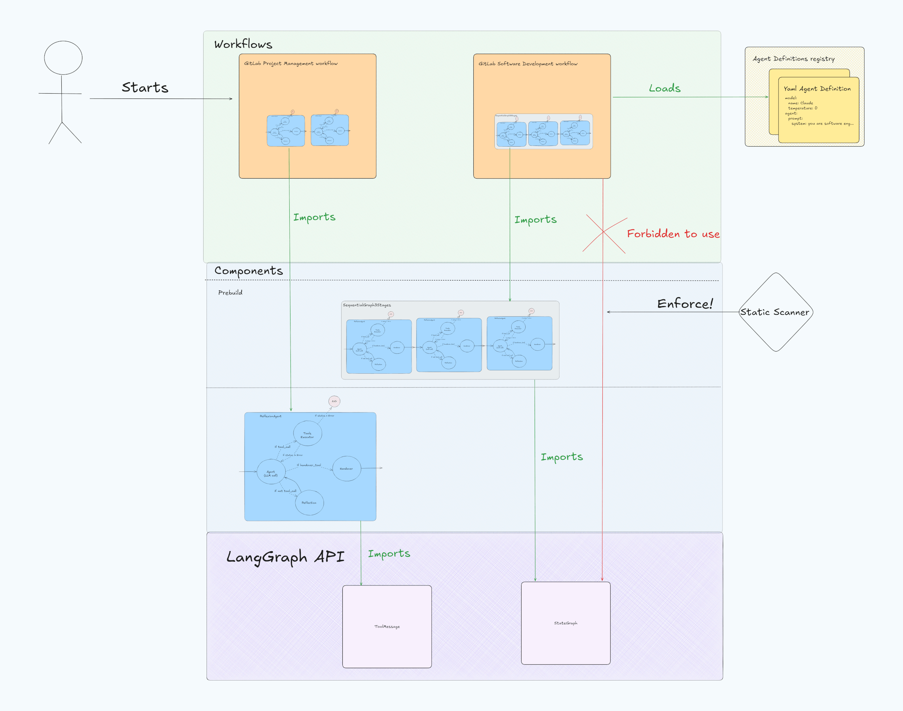

# Duo Workflow Service

The Duo Workflow Service is a Python-based component within GitLab
architecture that manages and executes AI-powered workflows using
LangGraph. It handles communication between the user interface, the
LLM provider, and the Duo Workflow Executor, while maintaining
workflow state through periodic checkpoints saved to GitLab. This
service provides the intelligence layer that interprets user goals,
plans execution steps, processes LLM responses, and orchestrates the
necessary commands to complete tasks - all while maintaining a secure
boundary between untrusted code execution and the core GitLab
infrastructure.

## Local development with GDK

You should [set up GitLab Duo Workflow with the GitLab Development Kit (GDK)](https://gitlab.com/gitlab-org/gitlab-development-kit/-/blob/main/doc/howto/duo_agent_platform.md).

The GDK setup documentation also explains how to ensure that all feature flags and
settings are enabled so that Duo Workflow works.

## Local development without GDK

You can also manually set up Duo Workflow by following these steps:

1. Ensure you have met all prerequisites locally (this list may not be exhaustive, GDK setup script is)
   - [GitLab Ultimate cloud license](https://docs.gitlab.com/development/ai_features/ai_development_license)
   - [Experiment and beta features setting](https://docs.gitlab.com/user/gitlab_duo/turn_on_off/#turn-on-beta-and-experimental-features)
     enabled
   - Feature flag enabled: `Feature.enable(:duo_workflow)`

1. Install dependencies with [poetry](https://python-poetry.org/docs/#installing-with-pipx).

   ```shell
   poetry install
   ```

1. Copy the example env file in the Service repo.

   ```shell
   cp .env.example .env
   ```

1. Install [`gcloud`](https://cloud.google.com/sdk/docs/install)
1. Login using your GitLab Google account by running:

   ```shell
   gcloud auth login
   ```

1. Set the `ai-enablement-dev-69497ba7` as active project by running:

   ```shell
   gcloud config set project ai-enablement-dev-69497ba7
   ```

1. Create the credentials for the application.

   ```shell
   gcloud auth application-default login --disable-quota-project
   ```

1. Optional: The `ai-enablement-dev-69497ba7` Google Cloud project should be available to all engineers at GitLab. If
   you do not have access to this project, unset `AIGW_GOOGLE_CLOUD_PLATFORM__PROJECT` in `.env` and instead set
   `ANTHROPIC_API_KEY` to a valid Anthropic API key.

1. Optional: You can disable auth for local development in the `.env` file. This
   disables authentication or the gRPC connection between the Duo Workflow Service
   and Duo Workflow Executor but a token is still required for requests to
   your local GitLab instance.

   ```shell
   DUO_WORKFLOW_AUTH__ENABLED=false
   ```

1. Run the Duo Workflow Service server.

   ```shell
   poetry run python -m duo_workflow_service.server
   ```

1. If you can correctly connect to Claude, you should see something
   like this in the output.

   ```shell
   {"event": "I'm Claude, an AI assistant created by Anthropic."...
   ```

## Debugging and troubleshooting

See the Duo Workflow [troubleshooting handbook page](https://handbook.gitlab.com/handbook/engineering/development/data-science/ai-powered/duo-workflow/troubleshooting/)
and the [Duo Workflow Service runbook](https://runbooks.gitlab.com/duo-workflow-svc/) (useful for working with logs and operational tasks).

### Debugging production flow failures

When a flow execution fails in production, the fastest path from a failing workflow to the root cause is via GCP Cloud Logging.

1. Get the workflow ID from the agent sessions UI. Note the approximate time the flow ran.
1. Query [GCP Cloud Logging](https://console.cloud.google.com/logs/query) in the
   `gitlab-runway-production` project, narrowing the time range to a window around the
   flow execution to keep the query fast:

   ```plaintext
   resource.type="cloud_run_revision"
   resource.labels.service_name="duo-workflow-svc"
   jsonPayload.workflow_id="<id>"
   jsonPayload.level="error"
   ```

1. Read the matching entries. The most useful fields:

   | Field | What it tells you |
   |---|---|
   | `event` | Which call site failed, e.g. `"fetch merge request diffs request failed"`. Comes from the `identifier` argument in `_process_http_response`. |
   | `status_code` | HTTP status returned by Rails (or another upstream). |
   | `response_body` | First 300 chars of the upstream response — usually contains the actual error message. |
   | `logger` | Python module that emitted the log, narrows where to read code. |
   | `correlation_id` | Propagates to the corresponding Rails request log if you need to cross-reference. |

### Issues connecting to 50052 port

JAMF may be listening on the `50052` port which conflicts with the GitLab Duo Workflow Service.

```shell
$ sudo lsof -i -P | grep LISTEN | grep :50052
jamfRemot  <redacted>             root   11u  IPv4 <redacted>      0t0    TCP localhost:50052 (LISTEN)
```

To work around this, run the server on 50053 with:

```shell
PORT=50053 poetry run duo-workflow-service
```

## Common commands

- Run tests.

  ```shell
  make test
  ```

- Run linter.

  ```shell
  make lint
  ```

- Generate Protobuf files.

  ```shell
  make gen-proto
  ```

- Test the client.

  ```shell
  poetry run python -m duo_workflow_service.client
  ```

## Export all tool specs

Export tool specifications in OpenAI format from the Duo Workflow service using the steps below.

### Prerequisites

- Duo Workflow service must be running
- `grpcurl` tool installed on your system

### Step 1: Install grpcurl

If you don't have `grpcurl` installed, install it using Homebrew:

```shell
brew install grpcurl
```

### Step 2: Export Tool Specs

Run the following command to export all tool specifications:

```shell
grpcurl -plaintext -d '{}' gdk.test:50052 DuoWorkflow/ListTools | jq '.tools[] | {name: .function.name, description: .function.description}'
```

This command will:

- Connect to the Duo Workflow service at `gdk.test:50052`, replace the host name and port according to your local dev setup
- Call the `ListTools` method
- Extract and format the tool name and description for each tool using `jq`. If you want the raw output, you can remove the part of `jq` command.

### Expected Output

The command will return a JSON object for each tool containing:

- `name`: The function name
- `description`: The function description

Example output:

```json
{
  "name": "read_file",
  "description": "Read the contents of a file.\n\n    IMPORTANT:\n    - When a task requires reading multiple files, include batches of tool calls in a single response\n    - Do not make separate responses for each file - group related files together\n\n    "
}
```

## Architecture

<https://handbook.gitlab.com/handbook/engineering/architecture/design-documents/duo_workflow/>

### LangGraph Abstraction Layers

The Duo Workflow Service is organized into three distinct abstraction layers to support modularity, flexibility, and
future extensibility.



1. **LangGraph APIs Layer**

   - The foundational layer that directly interacts with the LangGraph package.
   - External to GitLab repository and accessed via LangGraph package imports.
   - Provides low-level functionality for building workflow graphs.

1. **Components Layer**

   - First layer implemented directly in the Duo Workflow Service repository.
   - Uses LangGraph APIs to build modular graph components.
   - Creates reusable templates for workflow configurations.
   - Serves as a facade between low-level LangGraph APIs and high-level workflows.

1. **Workflows Layer**
   - Houses ready-to-use workflow configurations.
   - Built by combining components from the Components layer.
   - Configured with prompts and agent configurations from `AgentRegistry`.
   - Serves as a simplified entry point for building agentic features

Each layer is restricted to using only entities from the layer directly below it, enforced through static scanning in
CI. This architecture ensures:

- Modular and maintainable codebase.
- Support for future extensions like YAML DSL for external workflow configurations.
- Clear separation of concerns between different abstraction levels.

### Current Graph structure

To visualise current graphs, you can check [the current structure](../docs/duo_workflow_service_graphs.md), or if you've
made changes, run `make duo-workflow-docs`. This will generate updated mermaid diagrams.

## Using memory checkpointer

By default GitLab
[checkpointer](https://langchain-ai.github.io/langgraph/reference/checkpoints/#checkpoints)
is used for storing LangGraph checkpoints. For running automated tests, it can
be useful to store checkpoints only in memory - you can use `USE_MEMSAVER=1`
environment variable to use `MemorySaver`.

When using `MemorySaver`, human in the loop features and workflow status updates are disabled.

### Logging

Production logs are
[collected via LangSmith](https://smith.langchain.com/o/477de7ad-583e-47b6-a1c4-c4a0300e7aca/projects/p/5409132b-2cf3-4df8-9f14-70204f90ed9b?timeModel=%7B%22duration%22%3A%227d%22%7D&searchModel=%7B%22filter%22%3A%22and%28eq%28is_root%2C+true%29%2C+eq%28run_type%2C+%5C%22chain%5C%22%29%29%22%7D).

You will need access to LangSmith to view the logs. Please fill out
an [Access Request](https://handbook.gitlab.com/handbook/it/end-user-services/onboarding-access-requests/access-requests/)
to get access to LangSmith.

On local environment, set `DEBUG=1` to enable extended log output.

#### Controlling gRPC logging and tracing

Please refer to official guidelines for:

1. Available tracing options [documentation](https://github.com/grpc/grpc/blob/master/doc/trace_flags.md).
1. Available environment
   variables [documentation](https://github.com/grpc/grpc/blob/master/doc/environment_variables.md).

A
past [commit](https://gitlab.com/gitlab-org/duo-workflow/duo-workflow-service/-/commit/775462e46b838e9ad39d0394b9a51bc647d91121)
that modified gRPC tracing configuration.

### Events Tracking

We use GitLab Internal event tracking to track workflow events. See [internal_events](../docs/internal_events.md) for
details.

## Testing with SWE Bench

For any changes that you think will have a markedly positive impact on Duo Workflow's ability to independently solve
coding tasks such as SWE bench, run the manual SWE bench job to confirm the behavior of Duo Workflow with your changes.

### Running the manual SWE bench job

1. Create a merge request (MR) with your changes
1. In the MR interface, click on the gear/wheel icon ⚙️ next to "regression-tests" in the pipeline section
1. This will trigger the manual SWE bench job with your changes

### When to run SWE bench tests

- After making changes to the planning or execution components
- When modifying prompts or agent configurations
- After updating the underlying LLM or adjusting model parameters
- When implementing new tools or enhancing existing tool functionality

Running SWE bench tests before submitting your changes for review can help identify potential regressions and validate
improvements in Duo Workflow's problem-solving capabilities.

## Adding a New Tool to the System

For comprehensive instructions on adding a new tool to the Duo Workflow Service, refer to the dedicated
guide: [Adding New Tool](../docs/adding_new_tool.md).

## JWK Signing Key and Validation Key

The Duo Workflow Service uses its own pair of self-signed JWT keys, separate from the AI Gateway keys, to validate incoming JWTs from the Duo Workflow Executor:

- `DUO_WORKFLOW_SELF_SIGNED_JWT__SIGNING_KEY`: the primary key used to validate incoming JWTs.
- `DUO_WORKFLOW_SELF_SIGNED_JWT__VALIDATION_KEY`: a secondary key consulted during token validation, used to accept tokens signed with the previous signing key during and after a key rotation.

Both keys are passed to `LocalAuthProvider` (from `gitlab_cloud_connector`), which uses them to validate the JWT signature on each incoming request.

### JWK signing key rotation

The `DUO_WORKFLOW_SELF_SIGNED_JWT__SIGNING_KEY` and `DUO_WORKFLOW_SELF_SIGNED_JWT__VALIDATION_KEY` private keys should be rotated yearly.
For a reminder issue template, see this [DWS key rotation issue](https://gitlab.com/gitlab-org/modelops/applied-ml/code-suggestions/ai-assist/-/work_items/2289).

#### Keep already issued tokens valid during key rotation

Once `DUO_WORKFLOW_SELF_SIGNED_JWT__SIGNING_KEY` is rotated, tokens signed with the old key would immediately stop being valid.
To continue supporting already-issued tokens for up to their intended lifetime, set `DUO_WORKFLOW_SELF_SIGNED_JWT__VALIDATION_KEY` to the value of the **old** signing key before deploying the new one.
DWS will then accept tokens validated by either key during the transition period.

#### Steps to rotate the key

**Before performing any production-related changes, notify the AI Framework team in `#g_ai_framework`** so they can quickly react to any incident.

Tokens should be rotated in the following vaults for both staging and production environments. Anyone with vault access to the `service/duo-workflow-svc` paths can perform these rotations, not just AI Framework team members. For additional help, contact the `#g_ai_framework` channel.

| Staging | Production |
|---------|------------|
| [Duo Workflow Service](https://vault.gitlab.net/ui/vault/secrets-engines/runway/kv/list/env/staging/service/duo-workflow-svc/) | [Duo Workflow Service](https://vault.gitlab.net/ui/vault/secrets-engines/runway/kv/list/env/production/service/duo-workflow-svc/) |

Start by updating staging first and verifying it works as expected before proceeding to production. When updating production, make sure changes are made outside of public holidays and Fridays, and that there is sufficient team coverage to support in case of an incident.

1. Update the `DUO_WORKFLOW_SELF_SIGNED_JWT__VALIDATION_KEY` environment variable in the [staging Vault](https://vault.gitlab.net/ui/vault/secrets-engines/runway/kv/list/env/staging/service/duo-workflow-svc/) with the **current** value of `DUO_WORKFLOW_SELF_SIGNED_JWT__SIGNING_KEY`.
1. Generate a new signing key: `openssl genrsa -out jwt_signing.key 2048`
1. Update `DUO_WORKFLOW_SELF_SIGNED_JWT__SIGNING_KEY` in the staging Vault with the newly generated key.
1. Deploy a new revision of the DWS to staging (ask a Runway team member or an SRE, or anyone with permission to run Runway jobs in the [duo-workflow-svc deployments pipeline](https://gitlab.com/gitlab-com/gl-infra/platform/runway/deployments/duo-workflow-svc/-/pipelines)).
1. Confirm DWS is working correctly on staging (for example, test Duo Agent Platform on <https://staging.gitlab.com> and verify via GCP logs).
1. Repeat the same steps for production using the [production Vault](https://vault.gitlab.net/ui/vault/secrets-engines/runway/kv/list/env/production/service/duo-workflow-svc/). Ensure changes are made outside of public holidays and Fridays, and that there is sufficient team coverage.
1. Create a Slack reminder in `#g_ai_framework` to be triggered 3 days after the signing key rotation, to rotate the validation key.
1. Create a new issue as a reminder to rotate the keys again with a due date 1 month before the next rotation schedule.
1. Create a Slack reminder in `#g_ai_framework` to be triggered 1 month before the next rotation schedule.
1. After 3 days, generate a new validation key: `openssl genrsa -out jwt_validation.key 2048`
1. Update `DUO_WORKFLOW_SELF_SIGNED_JWT__VALIDATION_KEY` in the Vault with the newly generated key.
